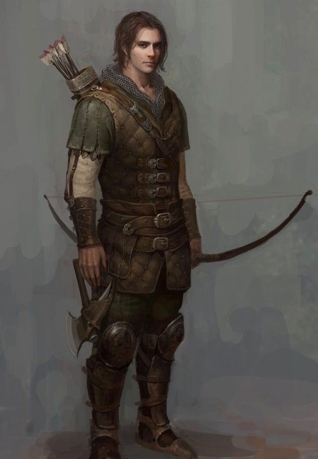

# William Galset

## Attributes and Core Skills

| STR       | 0 |    | RFX             | 1 |    | INT               | 0 |    |
| --------- | :-: | :-: | --------------- | :-: | :-: | ----------------- | :-: | :-: |
| Athletics | 0 | 3d6 | Acrobatics      | 2 | 6d6 | Communication     | 0 | 3d6 |
| Climb     | 0 | 3d6 | Perception      | 1 | 5d6 | General Knowledge | 0 | 3d6 |
| Endurance | 0 | 3d6 | Sleight of Hand | 1 | 5d6 | Survival          | 1 | 4d6 |
| Lift      | 0 | 3d6 | Stealth         | 2 | 6d6 | Will              | -1 | 2d6 |

## Vocations and Vocational Skills

| Scout {RFX, INT}              | 2 | 6d6 | Fellkin {STR, RFX, INT}     | 0  | 4d6 |
| ----------------------------- | :-: | :-: | --------------------------- | -- | --- |
| Medium Sword {STR, RFX, INT} | 2 | 6d6 | Shadowcraft {STR, RFX, INT} | -1 | 3d6 |

## Effects:

|           Name           |                             Effect                             | Duration |                                                       Source                                                       |
| :----------------------: | :-------------------------------------------------------------: | :------: | :-----------------------------------------------------------------------------------------------------------------: |
|  Minor Silver Weakness  |     +1 to the level of injury received from Silver damage.     |          |                                                    Fellkin blood                                                    |
|  Physical Defense Level  |                                3                                |          |                                                        Armor                                                        |
|       Medium Size       |                      5x5 ft on battle map.                      |          |                                                                                                                    |
|    Language: Babelish    |                       Can speak Babelish.                       |          |                                                                                                                    |
|        Language:        |                          Can speak .                          |          |                                                                                                                    |
| Disabling: Exposure Fear | Irrationally afraid of being found to be a Red Legion Deserter. |          |                                                                                                                    |
|  Disabling: Kleptomania  |        Desire to steal most things regardless of value.        |          |                                                                                                                    |
|     Equipment Weight     |                            29.75 lb                            |          |                                                      Equipment                                                      |
|  Humanoid Carry Weight  |                             120 lb                             |          | +50 lbs Max Carry Weight per Lift dice |
|       Light Weight       |                 -0d6 to STR/RFX governed Dice Pools                 |          |                                              0% - 25% of carry weight                                              |
| Terrestrial Combat Speed |                             40 ft                             |          |                              +10 ft (per Athletics Dice), +/-10 ft (per RFX)                              |
|   Swim Combat Speed   |                              15 ft                              |          |                              +5 ft (per Athletics Dice), +/-5 ft (per RFX)                              |
|   Climb Combat Speed   |                              15 ft                              |          |                                +5 ft (per Climb Dice), +/-5 ft (per RFX)                                |

## Combat Rolls:

|          Name          | One Handed | Two Handed | Dual Wielded | Penetration |  Range  | Damage Types | Engageable Opponents | Area Of Effect | Resource Class |
| :--------------------: | :-------------: | :-------------: | :---------------: | :---------: | :------: | :---------------: | :-----------------------: | :-----------------: | :-----------------: |
|        Shortbow        |      None      | 5d6 (+1d6) |       None       |      0      | Extended |                  |           Rapid           |        None        |        Arrow        |
| Medium Thrusting Sword | 7d6 (+1d6) | 8d6 (+2d6) |  8d6 (+1d6)  |      2      |  Melee  |      Pierce      |           Rapid           |        None        |        None        |
| Medium Slashing Sword | 8d6 (+2d6) | 9d6 (+3d6) |  9d6 (+1d6)  |      0      |  Melee  |       Slash       |           Rapid           |        None        |        None        |
| Small Thursting Point | 5d6 (+0d6) | 5d6 (+0d6) |      (+1d6)      |      2      |  Melee  |      Pierce      |           Rapid           |        None        |        None        |
|  Small Slashing Blade  | 6d6 (+1d6) | 6d6 (+1d6) |  7d6 (+1d6)  |      0      |  Melee  |       Slash       |           Rapid           |        None        |        None        |

|      Name      | Resource Class | Resource Dice | Penetration | Range | Damage Types | Area Of Effect |
| :-------------: | :-----------------: | :----------------: | :---------: | :---: | :---------------: | :-----------------: |
| Broadhead Arrow |        Arrow        |  6d6 (+1d6)  |      1      | None |      Pierce      |        None        |

## Destiny Points: 1/3

## Fellblood: 0/0

## Equipment:

| Name                          | # |                              Class                              |  Tier  | Durability |  LB  | Value |
| ----------------------------- | :-: | :-------------------------------------------------------------: | :-----: | :--------: | :--: | :----: |
| Gambeson Coat                 | 1 |                           Phy. Def. 1                           | Mundane |   12/12   |  5  |  2 bc  |
| Gambeson Leggings             | 1 |                          Phy. Def. 0.5                          | Mundane |   12/12   |  3  |  1 bc  |
| Leather Cuirass and Pauldrons | 1 |                          Phy. Def. 0.5                          | Mundane |   12/12   |  4  |  3 bc  |
| Leather Cuisses and Greaves   | 1 |                          Phy. Def. 0.5                          | Mundane |   12/12   |  3  |        |
| Leather Vambrace              | 1 |                          Phy. Def. 0.5                          | Mundane |   12/12   |  2  | 1.5 bc |
| Arming Sword                  | 1 |          Medium Thrusting Sword, Medium Slashing Sword          | Mundane |   12/12   |  2  | 10 bc |
| Dagger                        | 1 | Small Thrusting Point, Small Slashing Blade, Thrown Small Point | Mundane |   12/12   |  1  |  2 bc  |
| Shortbow                      | 1 |                            Light Bow                            | Mundane |   12/12   |  2  | 25 bc |
| Broadhead Arrow               | 20 |                         Standard Arrow                         | Mundane |     -     | 0.05 |  5 cc  |
| Quiver (capacity: 20)         | 1 |                                                                | Mundane |            |  1  |  1 bc  |
| Satchel (2/5 ft^3)            | 1 |                         12 lb container                         | Mundane |            |  2  |  1 bc  |

## Containers:

### Satchel

| Name                   | # | Class |  Tier  | Durability |  LB  | Value |
| ---------------------- | :-: | :---: | :-----: | :--------: | :--: | :----: |
| Waterskin (4/4)        | 1 |      | Mundane |            |  5  | 20 cc |
| Rations (1 day)        | 7 |      | Mundane |            |  2  | 350 cc |
| Rope, Hempen (50 feet) | 1 |      | Mundane |            |  10  |  100c  |
| Soap                   | 1 |      | Mundane |            | 0.5 |  2 cc  |
| Clothes, Traveler's    | 1 |      | Mundane |            |  4  | 200 cc |
| Piton                  | 10 |      | Mundane |            | 0.25 | 50 cc |
| Playing Card Set       | 1 |      | Mundane |            | 0.2 | 50 cc |
| Bronze Coin            | 2 |      | Mundane |            | 0.04 |  2 bc  |
| Copper Coin            | 28 |      | Mundane |            | 0.56 | 28 cc |

## Appearance:

Age: 22

Race: Wraithkin

Height: 5' 6"

Weight: 160 lb

Body Type: Wiry

Additional Details: Burn scars on the left side of his face, one eye is grayed out but he's not blind in it.

## Disposition:

* Distrustful
* Bitter
* Always pays back a debt
* Aggressive

## Beliefs/Morality:

* Myself over most.
* If I can take it, it belongs to me.
* Some things are worth dying over.
* Treasure what you have, and take care of it.
* Friends are rare, let those that you have lean on you.

## Goals/Aspirations:

* Earn enough money to send back to his family to get them out of debt.
* Destroy the loan baron that tricked his family.
* Steal Vasilii's money.

## Notes:

## Backstory:

Born to a poor family in Reddland, William lives much of his life on the street, growing up amongst a tough crowd that taught him how to steal his bread, and provide for his family in a small way. During this time he became a proficient pickpocket and padfoot, and began to learn that taking from others felt good. However during these times, to save his sister from the Spore, his family had to take out a large loan to be able to purchase Healing Blood, being scammed by the loan baron that tricked them into the egregious loan. Now unable to support themselves thanks to the extreme conditions of the loan, William decides to take up a job as a mercenary at the age of 18, in order to send money back to his family in hopes of one day clearing them of their debt.

During this time, William met a man named Burrowbard Stoneseeker and began to work for him, and after a time Burrowbard found out that William's family was desperately in debt due to his family being scammed by a loan baron, and he was only working as a mercenary in order to pay it off. This made him sympathize with William and buy his family's debt out, charging no interest on the condition that William worked for him exclusively from then on. William enthusiastically agreed and began to work under him as his private mercenary.
