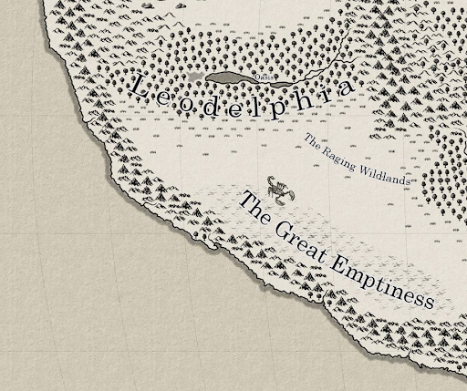

# Leodelphia

Leodelphia is a Beastkin majority nation of tropical forests,expansive grasslands, and mysterious deserts. Ruled by the Leodelphia royal family.

## Oasis

Oasis is a mainly Felinekin population. A city of exotic colors, architecture, people and cuisine, it serves as one of the largest trade city and capital of Leodelphia. Built in the heart of a jungle flanked by two great lakes on either side. Stone pyramids and dwellings built straight into the petrified gargantuan trees make up the majority of dwellings within Oasis, as the ground level routinely flood due to the proximity to the two lakes. Oasis has complex plumbing systems and captures rain water in water towers that sit atop a percentage of the grand trees. Travel between the various tree dwellings and stone pyramids is done via massive rope bridges that span as wide as roads in other cities.

The Brightinist religion of Oasis permeates all aspects of life. The Beautiful One, the Bargainer, and the Ravenous Ones all have their followers within the city.

The cast system of Oasis is extremely apparent to new comers, with locals content as part of day to day life. The massive tree dwellings that are not owned by the Leodelphia government for public use are owned by the Great Prides. They nobility and rich classes live near the canopy, with private rope bridges connecting to other of the great pride's trees dwellings. They live in absolute luxury, a stark contrast to to bustling city that occupies the lower portions of the trees. Each great house is headed by a male patriarch with many wives.

The lower portions of the tree dwellings, seen as the less desirable but good enough commercial and average citizen use, are home to the rich cultural spectacles and merchant bazars around every corner. The drug mirage is a major export of Oasis, coming from the neighboring desert known as the Great Emptiness. Being a large trade hub traders, mercenaries, artists, and slavers flow in and out of the city every day.

The portions of Oasis closest to the jungle floor are regarded as the most dangerous areas in the city. Light barley makes it below and hostile creatures roam. Only the poor, desperate, or criminally inclined reside close to the ground level.

## The Raging Wildlands

The Raging Wildlands represent a vast area made up of seas of grass. Vast caravan networks travel between Oasis, The Great Emptiness, and Caurus to the East. Valuable good flow through these land, prime among them Mirage, a drug harvested from the Great Emptiness.

### The Hordes

These vast caravan networks are constantly preyed upon by nomadic tribes of feral, Mirage addicted, Beastkin raiders know as the Hordes. Predominantly the Hordes are made up of Hyenakin and Leshinkin decent. Seeking the vast riches each caravan contains as well as the potential slaves the caravan workers represent, they are a constant threat to all caravan in the region. Naturecraft is commonly used to not only lay traps that bind the target caravans, but also for day to day tasks within the Horde.

At the top of each Horde sits a "Grass Lord", who maintains control through might and the spoil each caravan raid entails. Each with there own distinct tribe, they constantly war with each other over the territory and roads the caravan flow through.

Through the constant raiding of caravans, each Grass Lord accumulates their own caravan. These Horde caravans are closer to moving cities, leaving vast swaths of trampled grass in their wakes. At the heart of the Horde caravan is the Grass Lord's heavily defended personal caravans, holding all of the wealth and Mirage accumulated by said Grass Lord.

A mount in Horde culture is seen as a symbol of status. From horses, elephants, large insectoid, and various other creatures make up the diverse mounts that present in a Horde.

## The Great Emptiness

The Great Emptiness represent a vast inhospitable desert home only to nomadic tribes and the highly adapted wildlife, with the great sand worms being the most not worthy.

It is said that long ago vast lush lost kingdoms existed in the Great Emptiness, with some ancient calamity dooming entire region to be swallowed in sand.

### Mirage

The drug Mirage is used wildly across Terra as it seems to give visions of what the user desires most. In small doses this deludes reality, where even if negative things are happening to the user, they are instead represented as a positive scenario in their mind. When medium doses that are consumed, the positive effects only take place in the user's mind leaving them in a barley conscious relaxed state. In higher doses, the user is put into a deep slumber.

Brightinist that worship the Bound One regularly indulge in said drug, using it to enter into the deep slumbers they so desperately seek. Those that overdose on Mirage never awake, beginning to sleep walk towards the Great Emptiness from where ever they are on Terra.

Mirage is found in the sand of the Great Emptiness, all seemingly flowing from the center of the desert. The winds, massive sand worms, and earthquakes continuously ensure a steady steam of harvestable Mirage. Those that travel too deep into the Great Emptiness inevitably overdose, leading to a never ending slumber, sleep walking towards deeper and deeper into the desert.

### The Slumbering Tribe

One of the nomadic tribes who calls the Great Emptiness home, this Foxkin tribe is very reclusive. By harvesting and bartering with Mirage, they are able to acquire the supplies required to live in the harsh environment of the Great Emptiness.

All members of the Slumbering tribe indulge in Mirage. Believing Mirage to be the physical manifestation of their god, the Slumbering One. Eventually when nearing the end of their lives, tribe members will overdose on Mirage, wandering off into the desert to be with their god.

### The Ravenous Tribe

One of the nomadic tribes who call the Great Emptiness home, this Scorpionkin tribe is generally extremely hostile and wise to avoid. Generally only intentionally encountered when bartering for Mirage for the supplies they need to endure the harsh conditions of the Great Emptiness.

Worshipping the Ravenous One, the members of the tribes ritualistically sacrifice would be captives and slaves to the great sand worms who roam the desert. The Ravenous Tribe sees these worms as descendants of their god.
