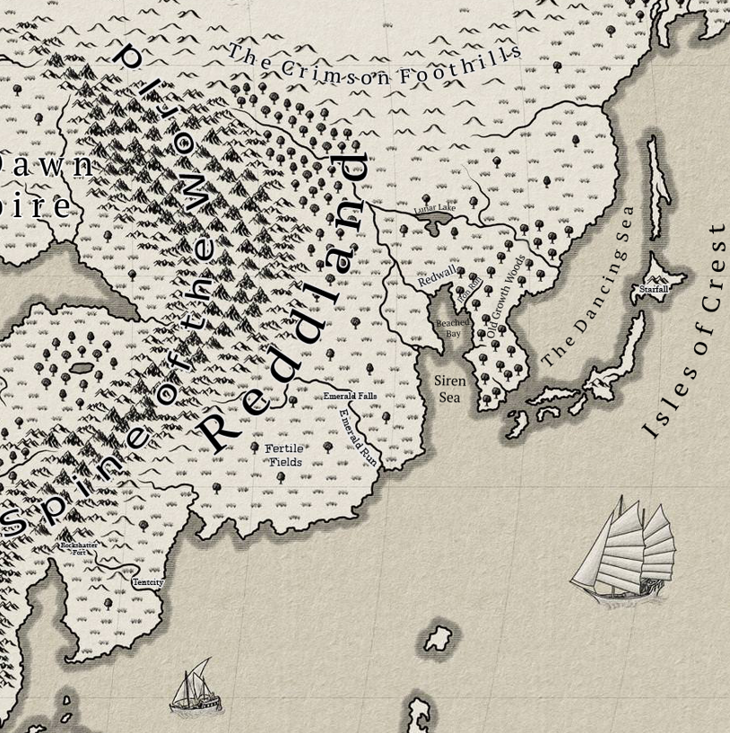
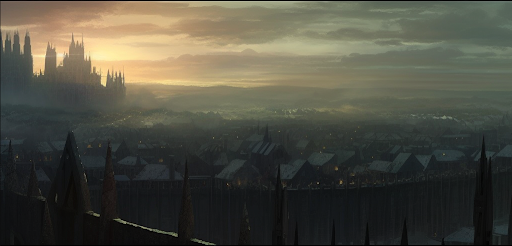
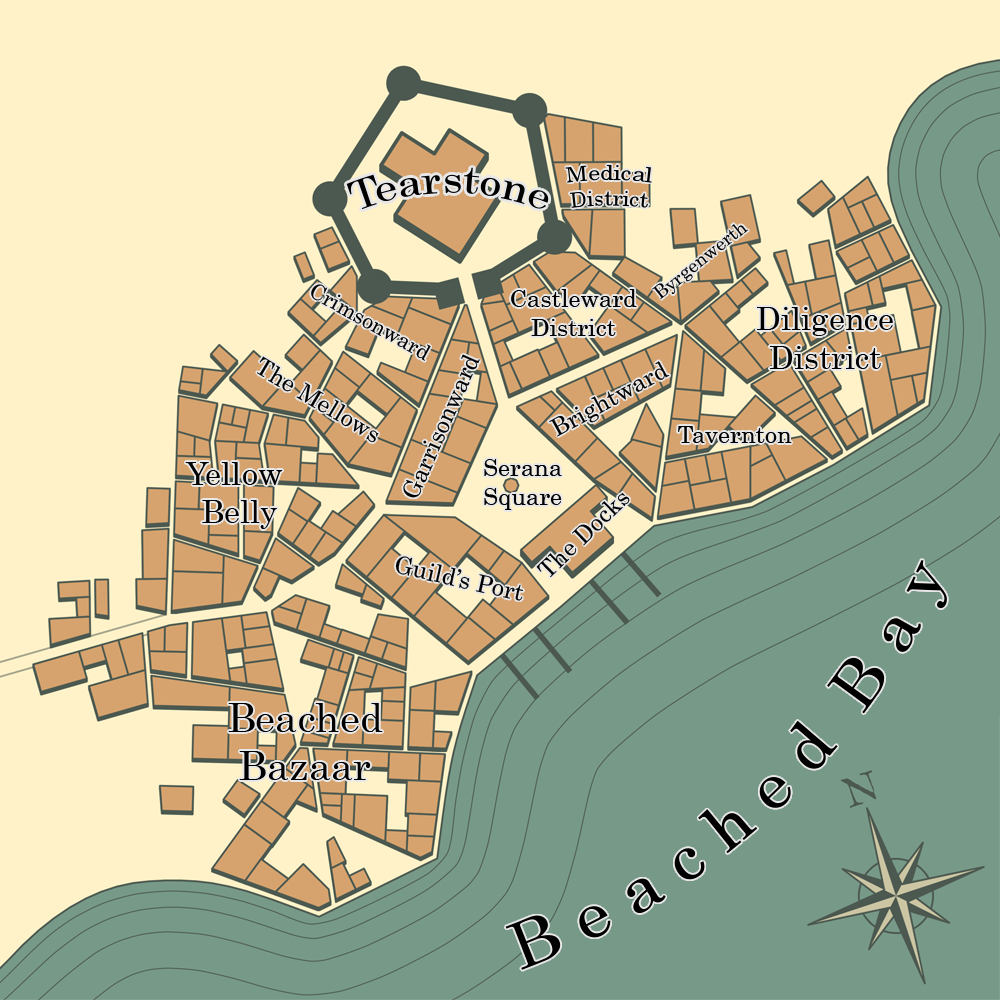

## Reddland

#### A History of Conquest and Resilience

During the Dark Ages, the vast realm now known as Reddland was under the iron grip of a formidable Siren dynasty, led by the infamous Witch Queen Alana. Revered for her mastery of Runecraft and Fellweave, Alana's unnaturally extended lifespan testified to her involvement in dark rituals and her insatiable thirst for power. The Witch Queen's dominion began with the assassination of the Chitkin Queen of Caraus, where she seized control over the Chitinkin population, bending them to her will. Her unstoppable army of mentally enslaved Chitinkin and Siren loyalist advanced eastward, subjugating vast territories that now form the heart of Reddland. However, the rugged and defiant Crimson Foothills, inhabited by nomadic tribes and city states of dhampirs, proved to be an unconquerable land.

In this enduring stalemate, a pivotal figure emerged. A young Centurion of the Dawn Empire named Serana Reddington, a former slave and personal attendant of the Witch Queen, defected from the Dawn Empire Legion and embarked on a perilous mission to liberate her people. Denied military aid by the empire, Serana journeyed to the Crimson Foothills, where she rallied the scattered tribes and city states of her Dhampir kin against their common oppressor. Against all odds, she led her army, known as the Redd Legion, to numerous victories, shattering the Witch Queen's forces time and again. The ultimate triumph came as Serana orchestrated a daring covert operation, infiltrating Tearstone Castle, the Witch Queen's capital, while her forces besieged the city. In a fierce and treacherous battle, Serana emerged as the sole survivor, dealing the final blow to the Witch Queen's reign.

In the wake of this hard-fought victory, the people of Reddland acclaimed Serana as their rightful ruler, establishing a new era for the land. To secure peace and stability, Serana humbly pledged allegiance to the Dawn Empire, earning a seat within the imperial senate and favorable terms for Reddland. The nation prospered, thanks to flourishing trade, renowned magical and medical institutions, a formidable naval fleet, and the Redd Legion, renowned as one of the finest military forces in the world. Reddland's prominence and power became undeniable, solidifying its position as one of the most influential countries on the continent.

In recent years, Reddland has been marked by remarkable advancements in medicine, thanks to the brilliant Veronica Reddland, the current ruler and a visionary leader. Encompassing a significant portion of the eastern edge of the continent, Reddland's population is predominantly composed of dhampirs, reflecting their enduring heritage and cultural dominance within the realm.

#### The Laughing Storm

Captain Flint Storm, the Laughing Storm, was an illegitimate child of a noble vampire house called the Daywalkers, hailing from the renowned city of Crossroads. As a pirate, he encountered Victoria Reddington's vessel and, unexpectedly, fell deeply in love with her. Moved by this affection, Flint released her ship along with all its cargo.

#### The Redd Blasphemy

Lord Maxwell Reddington, the designated successor of House Reddington and the Kingdom of Reddland, shared his sister Veronica's scholarly pursuits as an academic of Byrgenwerth. Fascinated by the ancient Siren culture that once thrived in Reddwall, Maxwell dedicated his time and resources, including his dowry, to funding expeditions into the catacombs that now lay beneath Reddwall's foundations. Accompanied by his younger sister, Lady Veronica Reddington, Maxwell embarked on one such expedition, which led them to a remarkable discovery deep within the catacombs. Maxwell returned with a sword of great significance, while Veronica went on to pioneer the development of the first healing bloods of Reddwall.

However, following that pivotal day, Maxwell's path took a divergent turn as he became a devout worshipper of the Moon Presence. During a diplomatic mission to Crossroads alongside Veronica, Maxwell experienced a visible mental breakdown. In the presence of the Emperor, he unleashed a torrent of ravings and blasphemies against the Bright Lord, resulting in his condemnation for heresy and a sentence of death. Veronica, held captive as a hostage, nearly ignited a full-scale war between Reddland and the Empire. Fortunately, a notorious outlaw pirate lord known as the Laughing Storm intervened by blockading the Iris Sea, issuing a solemn promise to bring chaos and devastation to all vessels until Veronica was safely released.

Ultimately, peace prevailed between the two powers, but it came at a cost. As Veronica was unable to bear children, a binding agreement was reached that the next heir of Reddwall would be wedded to the future heir of the Dawn Empire, thereby uniting the countries through blood. This momentous event would later be referred to as "The Redd Blasphemy."

The Laughing Storm, renowned as one of history's most formidable pirate lords and outlaws, willingly surrendered himself to the Reddland navy. Initially condemned to death, he was pardoned by Lady Veronica Reddington in gratitude for his instrumental role in her rescue. However, he remained indebted and obliged to serve Lady Veronica for the remainder of his life. The enigmatic figure known as Flint Storm, also referred to as the Laughing Storm, faithfully served as Veronica's trusted advisor and the Warden of the Sea until their unexpected marriage.

Veronica and Flint attempted to conceive children, but tragedy repeatedly struck. After years of trying, Veronica finally gave birth to an sickly heir, a daughter whose hair bore the ethereal shade of pure white, reminiscent of the full moons that adorned the sky.

In accordance with the pact resulting from the "The Redd Blasphemy", Vex'halia Reddington would eventually be expected to marry Luc Lightbringer, heir to the Dawn Empire, unifying the two kingdoms in blood upon their wedding.

### Reddwall

Reddwall stands as the capital of Reddland, given its name for the massive red granite wall that surrounds it. Sitting atop the ruins of the previous capital of the Witch Queen Alana, Reddwall is littered with gothic superstructures made of varying colors of granite. Further from Castle Tearstone, structures are smaller, constructed of less desirable granite colors such as pale yellow or gray. As the construction nears Tearstone, shades of yellow transition to orange, then almost exclusively red as Tearstone is approached.

Among the many marvels, Byrgenwerth school of magic and medicines stands as one of the prominent staples of the city, responsible for the creation of the Healing Bloods of Reddwall under Lady Veronica Reddington. This discovery was key in halting the rampant Spore disease that affected Terra.

#### The Tragedy of Killroy the Fool

The legend of Killroy the Fool echoes throughout Reddland, encapsulating the events of the Redd Revolution and the humble fool who played a significant role in it. Over time, the name Killroy has become synonymous with ill fortune, leading many to shun its usage.

"Once upon a time, in the now-land of Reddland, the tyrannical Siren Witch Queen Alana ruled with an iron grip, using her malevolent magic to control the minds of her subjects.

During that era, the Siren's worship of the Moon Presence was viewed as heresy by the followers of Brightinist faith across the land of Terra. Serana Reddington, a devout Dhampir centurion serving in the Dawn Empire Legion, fervently sought the Emperor's blessing to liberate the lands from the clutches of the Witch Queen Alana. Although the Emperor granted her his approval, he provided no additional forces for the conquest, believing that if the oppressed people themselves did not rise up for their freedom, they did not deserve it.

Returning to the Crimson Foothills, a region constantly besieged by the Witch Queen and her Siren forces, Serana galvanized her fellow Dhampir kin. Blessed with natural leadership skills, she became their beacon of hope, inspiring them to form the Redd Legion in her honor.

Amidst the enduring conflict between dhampirs and their Siren oppressors, war loomed inevitable. Among the recruits who joined the ranks of the Redd Legion was a young Dhampir peasant named Killroy. Despite his humble upbringing, Killroy was renowned for his quick wit, striking looks, exceptional combat skills, and remarkable proficiency in Fellweave. He yearned to etch his name into the annals of history, aspiring to become a legend, and the impending war presented him with an opportunity to achieve glory.

During a grand feast held in honor of General Serana Reddington, Killroy audaciously challenged her to a duel. If he emerged victorious, he would lead the Redd Legion into battle. However, if he failed, Serana had the right to execute him on the spot. In Killroy's mind, Serana was just another pampered noble of whom he had bested on numerous occasions before, and this time would be no different. Serana, amused by the proposal, accepted the challenge. Thus, blades clashed, Fellweave were cast, and blood was spilled. In the end, Serana emerged as the victor, and a defeated Killroy closed his eyes, accepting his fate. But instead of the swoosh of a blade, all he heard was laughter. Rising from the ground, he surveyed the chuckling crowd. Amidst her laughter, Serana revealed what she had just declared to the onlookers.

"That was a bold yet foolish plan. However, it seems I have misplaced my court fool. So, instead of death, you shall be my fool."

And thus, Killroy's torment began as Serana's court fool. Donning ridiculous attire, he remained ever close to Serana, be it in camp or on the battlefield. On the eve of the legendary "Battle of the Wet Dress," Killroy made a sarcastic remark about Serana's feast attire. Consequently, clad in Serana's vibrant red dress, Killroy led the charge across the shallow Lunar River the following morning. It is said that the enemy general, upon witnessing Killroy's daring charge, dropped his telescope in the mud, convinced that he had lost his sanity, resulting in him relinquishing his command. Throughout the war, Killroy distinguished himself, often serving as Serana's second in command and personal bodyguard on the battlefield, for Serana always fought where the danger was greatest. The bond between the two grew inseparable, both in times of war and in moments of respite.

The war was relentless and brutal, but Serana's unwavering leadership became the deciding factor. The Redd Legion pushed deep into enemy territory, laying siege to the capital of the Witch Queen. During the siege, Serana, Killroy, and a select group of elite soldiers embarked on a covert mission to eliminate the Witch Queen once and for all, severing the head of the oppressive serpent.

Little did they know, the Witch Queen Alana, a master of forbidden runecraft, had crafted a ring with the intent to bring an end to the war and all future conflicts. Into this small blue ring, known as "The Singing Ring," she channeled her cruelty, malice, and unyielding desire for dominion. The ring faintly echoed a Siren lullaby, empowering the Witch Queen's mindcraft to unparalleled heights. As they ventured deeper into the capital, their comrades succumbed to fear, abandoning the mission and leaving only Killroy and Serana to face the treacherous final encounter.

The details of the ensuing battle remain shrouded in mystery, but when the Redd Legion eventually triumphed over the castle, they discovered the decapitated body of the Witch Queen Alana. Serana was found cradling the lifeless form of Killroy the Fool, her loyal companion who had stood by her side until the very end, his chest pierced by Serana's own sword. When questioned about the events that transpired, Serana offered no words, choosing to spend the night alone with Killroy's body in the solemn throne room. Come morning, clutching the head of the blasphemous Witch Queen, Serana declared victory in what is now known as Serana Square within the walls of Reddwall.

News swiftly reached Crossroads, carrying the Emperor's decree that legitimized Serana's right to rule the newly founded land of Reddland, albeit as a member of the Empire. Thus, Reddland came into existence, born from the sacrifices and triumphs of its valiant heroes.

Serana, forever changed by her harrowing battle with the Witch Queen, bore the weight of the years, her youthful energy replaced by the demeanor of someone twice her age. Her first act as ruler was to implement laws banning mind control through mindcraft, and the coerced consumption of unwilling Fellkin blood. She extended peace to the remaining Siren population, promising an end to the bloodshed and a chance for peace.

The position of Fool transformed into a revered title within Reddland, an honor bestowed posthumously upon those who had laid down their lives in acts of great valor to protect their comrades. Under Serana's reign, Reddland flourished, and an era of peace descended upon the land. Killroy, the once-forgotten fool, achieved the legendary status he had sought, forever etched into the annals of history.

And so, the tale concludes."

The story served as a testament to the power of loyalty, sacrifice, and the enduring spirit of those who strive to shape their destiny amidst the tides of war and destiny.

#### Tentcity

Located in the southern region of Reddland, Tentcity sprawls across the Everflow River Delta, a realm governed by House Roseblood. As the last descendants of the fabled Siren Witch Queen Alana, their noble lineage resides in the shadow of the illustrious Siren dynasty of yore.

The Sirens, masters of hydrocraft and the water manipulation runecraft, have harnessed their abilities to shape the river delta into a network of waterways that replace conventional streets. Consequently, much of the city's transportation revolves around the use of small boats, deftly navigating these intricate aquatic pathways.

Within the cityscape, thousands of colossal structures resembling tents stand tall, rivaling the size of buildings. While the Sirens possess extraordinary control over water, the unpredictable nature of the sea occasionally disrupts their plans. Consequently, the denizens of Tentcity must remain vigilant, heeding the predictions of the tide masters and relocating their tented abodes in accordance with the ever-shifting tides.

Amidst this tapestry of tents, one can find ancient blue stone structures interspersed throughout. These magnificent edifices trace their origins back to the time of the Witch Queen Alana. It was she who commissioned the construction of this city as a testament to her power upon emerging from the ocean depths with her formidable army. Crafted from exquisite blue, green, and purple marbles reminiscent of the structures that once graced the land where Reddwall now stands, these resilient buildings withstand the sea's wrath while harboring sanctuaries of air-tight chambers within. Regrettably, the art of ancient Siren construction was lost during the upheaval of the "Redd Revolution" and the subsequent defeat of the Witch Queen.

At the southern edge of the Delta stands the grandest of these structures, known as "Castle Pitchtent." Its core structure boasts ancient craftsmanship, enabling it to endure the relentless tides. Over the years, various additions in the form of complex collapsible tent-like structures have been integrated, blending tradition with innovation.

Submerged beneath the watery depths lies the enigmatic Wet District, an ethereal realm solely inhabited by Sirens or those gifted with the ability to breathe underwater. This district, though considered of lower social standing, harbors a breeding ground for crime and smuggling, its depths shrouded in secrets.

Tentcity thrives on its principal exports. From the expansive sea, a wealth of marine products grace its markets, captivating the senses of distant shores. Additionally, stone and rock extracted from the upstream reaches near Rock Shatter Fort contribute to the city's economic prosperity, offering valuable resources hewn from the banks of the Everflow River.
