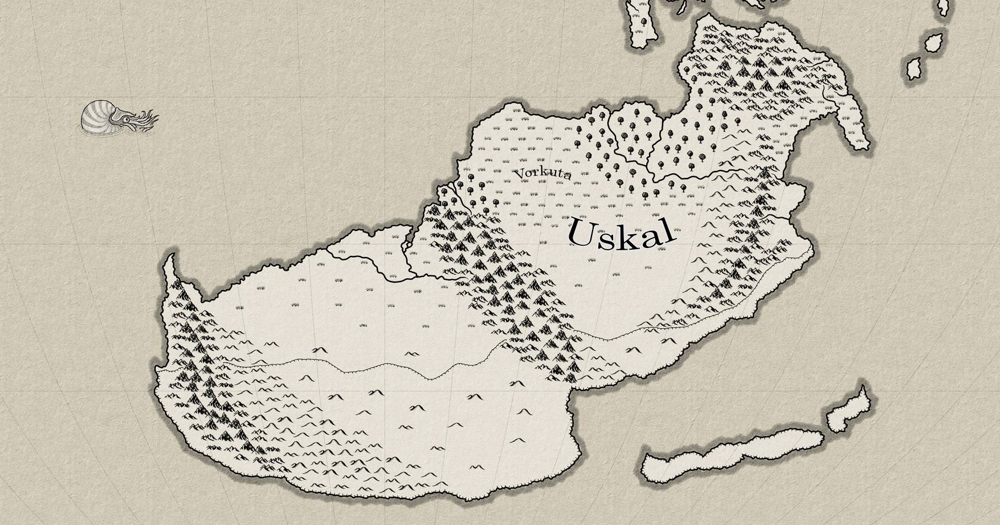

# Uskal

In the far southern reaches, one can find the harsh and unforgiving Uskal Colonies. These colonies were established during the Dark Age when the demand for silver was high in the ongoing battle against the wild monsters that littered Terra. Beneath the icy surface of Uskal, valuable silver and other precious resources were discovered.

The Dawn Empire, in need of silver for their war efforts against the monsters of Terra and seeking a place to dispose of undesirables, offered mudbloods, criminals, and prisoners an alternative to execution. Many individuals seized this opportunity and were transported to the Uskal Colonies to engage in the arduous work of mining and extracting precious resources.

The first lord of Uskal was Leopold Harkon, cousin to Serana Reddington, the founder of Reddwall. As the sixth-born son in his family, Leopold had little prospect of acquiring land or status. Viewing Uskal, despite its harsh and inhospitable nature, as his only chance to gain wealth and prestige, Leopold took charge of the colony and successfully managed it for hundreds of years. Eventually, he made a bold move, declaring Uskal to be his family's rightful inheritance. With the support of Reddland and the Dawn Empire's indifference as long as the resource flow remained steady, House Harkon became the new overseers of the Uskalian colonies.

In modern times, not much has changed. The frigid climate of Uskal persists, with an unending influx of monsters from the Frozen Tundra. As of now, the young Lord Albert Harkon assumes the role of Warden, following a tragic mining accident that claimed the lives of his father and older siblings. While his father ruled with an iron fist, Lord Albert is a more compassionate and distant ruler, modeling his laws and governance after his kinsmen in Reddland, who adopt a more progressive stance toward mudbloods. Under his leadership, the burdens and taxes on the people of Uskal have lessened. However, the weight of generations of oppression is not easily forgotten by some...
