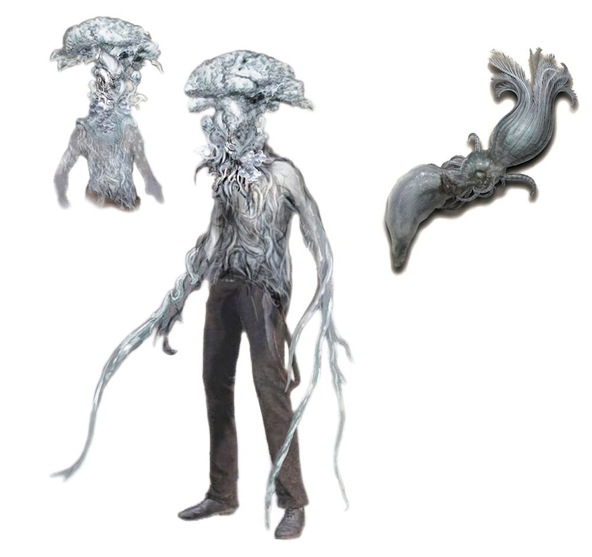

Once infected, a victim cannot pass on Shard's disease to a

## Diseases

### The Spore

The spore is an insidious parasitic fungus that exerts control over the brain stem of its unfortunate victims. Manifesting as a vibrant, luminous whitish-blue fungus, it releases airborne spores into the environment. Inhalation of even a small quantity of these spores leads to death within 1-3 months, while exposure to a significant amount results in rapid demise within a day to just a few minutes.

Once deceased, there follows a peculiar 36-hour hibernation period, after which the deceased individuals awaken and embark on a relentless quest to infect new victims. Over time, the fungus gradually emerges from the decaying host, seeking a high vantage point from which to disperse its spores far and wide.

During their dormant state, these infected individuals are referred to as carriers, serving as unwitting vessels for the propagation of the spore.

### Shards

Shards is a disease were by venom or blood transfer, pass on trace amount of Shards to the victim. Ancient legends claim that only those consumed by malice can infect others. Since only exceptional rare and dangerous monsters carry the shards disease, these myths might hold some weight.

Once infected, a victims cannot pass on Shard's disease to another victim. Small black crystalline structures begin to develop in the body, starting with the joints, moving to the brains. Movement is slowly reduced and the pain is immeasurable. The worst of it comes when it begins to develop in the brain, causing brain disfunction, waking nightmares, depression, raving madness, ect. The weaker or more hurt the victim is the faster it flares.

When the disease or circumstance put the victim in a dying state, a black crystalline spike will push through the brain out of the skull, leaving the victim surprisingly alive yet paralyzed. At this point the victim is considered highly dangerous, as hulking figures referred to as Harvesters will appear through strange dark portals to claim the body of the dead. They will drag the body back into the void with them. Harvesters are non-hostile, though if they are engaged or impeded, they will kill whatever is in there way without mercy. Harvesters have the unique ability to change there size, growing large when threatened or small when impeded by obstacles blocking them from their target. Citizens afflicted with shards often seek medical euthanasia rather than allow the disease to progress towards it's final stage.

It does not try to spread, seems to be not biological in nature, and seems to try to afflict the maximum amount of suffering possible on the victim. Though a highly guarded secret, Shard's disease is one of the only way know that a Brightkin can be permanently killed. It is speculation, but many scholars believe that shards is a disease not of this world, but was brought to Terra during the time when Demon's roamed Terra as a weapon against the Bright invaders. For what purpose is unknown.
