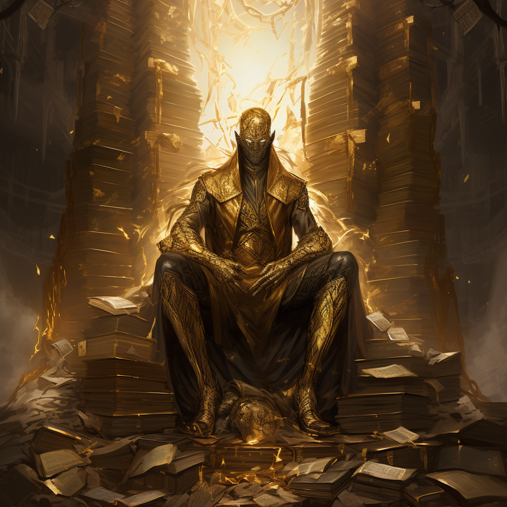

# The Bargainer

## Aspect

- Prosperity
- Secrets
- Knowledge
- Trickery

## Aliases

- The Clever One
- The Keeper of Secrets
- Bright of Trickery
- Cleverous

## Tenet

"Thou shall seek prosperity through the acquisition of wealth and the pursuit of knowledge."

## Lore

"Everything has a price..." - The Bargainer

During the Awakening, The Bargainer bestowed upon Fellkind the insatiable desire for prosperity and the thirst for hidden knowledge. The Bargainer encourages the people of Terra to accumulate wealth and unravel the secrets of the world.

Depicted often as a figure seated at a desk or throne, surrounded by symbols of clandestine knowledge and abundant riches, The Bargainer is revered by merchants, scholars, rogues, mercenaries, and spies.

Priests and priestesses devoted to The Bargainer hold positions of influence within the realms of merchants, scholars, and covert operatives. This group known as "The Bargainers" resembles a secret society, accessible only to those who actively seek wealth, possess hidden knowledge, or wield significant power.

## Relics

- None
