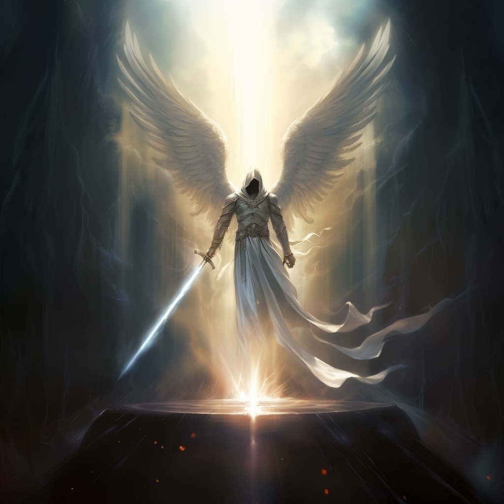

# The Bright Lord

## Aspect

- Light
- Intelligence
- Dominion

## Tenet

"Thou are created in the image of greatness, and shall seek strength, knowledge, and greatness to be closer to I, but shall recognize thine greatness is from within thine own labors."

## Aliases

- King of the Brights
- The Star of Dawn

## Lore

The Bright Lord is the chief deity of Brightinism. As the creator of Fellkind and Brightkind, he is worshiped widely across Terra across all walks of life.

It is said that the Bright Lord ascended into the heavens to tend to the heart of the star around which Terra orbits. From his vantage point, he keeps a watchful eye on his creations.

Priests of the Bright Lord are devoutly loyal to the Dawn Empire and Imperial family, which they see as the physical manifestation of the Bright Lords' will on Terra. They occupy high positions within the Imperial senate and are consulted whenever important decisions are made, as their visions said to be given by the Bright Lord himself are rumored to illuminate the very future.

The Inquisition also are fervent worshipers of the Bright Lord, carrying out what they see are the more brutal yet necessary aspects of faith. This includes the hunting of the heretical group known as the Cult of Amon.

## Relics

- Adversary
- The Crown of Thorns
