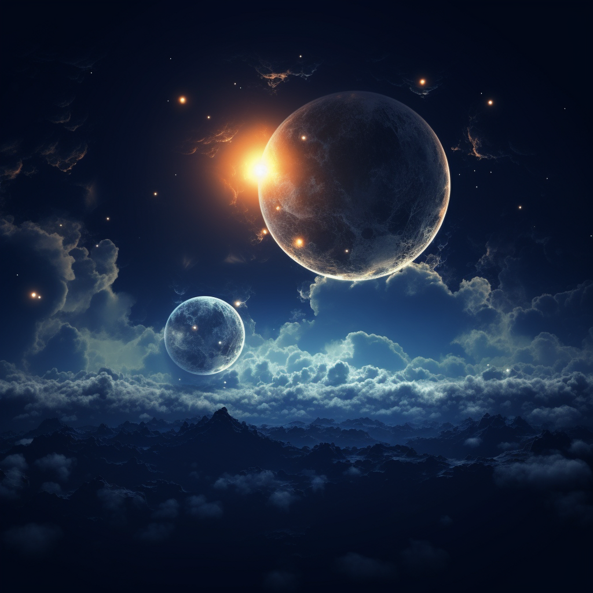

# The Moon Presence

## Aspects

- Raging seas
- Deep oceans

## Lore

Many inhabitants of Terra hold reverence for the Moon Presence, considering it a primal force that predates even the arrival of the Bright Lord. Legends speak of a time when the Moon Presence was whole, but during the Great Betrayal, the epic clash between Amon and the Bright Lord caused the moon to fracture, splitting it into two separate entities.

The larger of the two moons that grace the skies of Terra. Filled with anger and resentment due to its separation from its other half, the Old One is believed to harbor animosity toward the Bright Lord and his followers.

## Relics

- None
