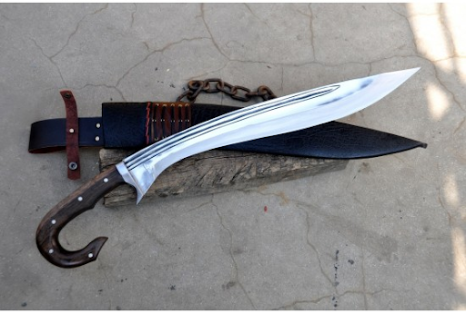
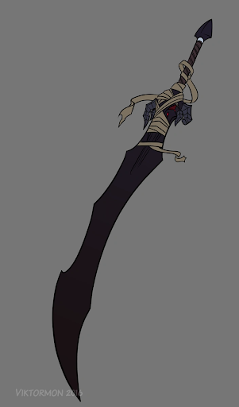
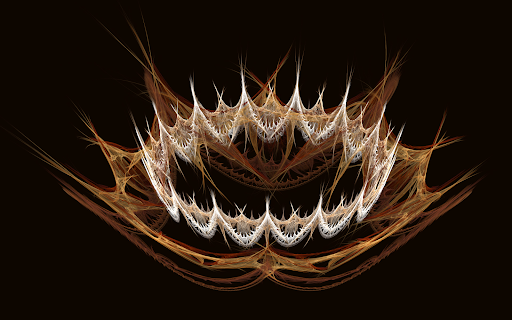
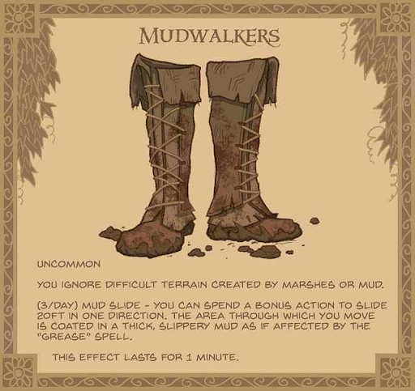
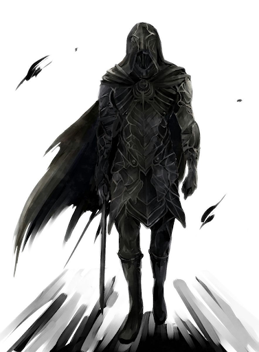
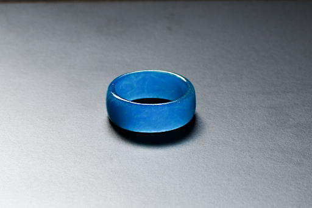
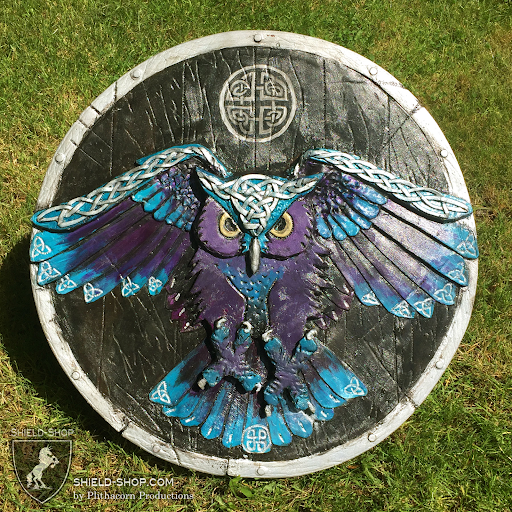

any wound delt heals you

poison scabbard

cane sword

Flaming tomahawk

Dawnshard

Frostnip

Frostbite

 magic red handkerchief

runecrafted cigars

Vespa

Honorable Intentions

electric Rapier

Noose magic item

Demon coins, 30 pieces of silver

 magic javk eye

Javk magic arm, thorn, Wooden Arm made of dark bron wooden thorns

Executioner swords

Early Muskets and Gun swords

Epilogue is a bipolar sword, can switch between rapier, sidesword, and bastard sword. Any opponent cut sword head falls off.

Push Dagger

Gauntlets swords

Man Catcher with spear at bottom

Darks souls/Elden ring talismans and runes

More Ammunition Types

Billhook

Denumont (Javk Dagger) Misericord

#### Phoenix Tears

It is quite common knowledge that Phoenix tears carry powerful healing properties. These healing effects can be instantaneous or require one to two days to take effect. Tears must be applied to the wounded area or ingested for toxins.

Runecrafted Bowstrings, weapon Buffs

Tattoo Runecraft weapons

Soulcraft soul gem binding souls

Fix blood healing prices

Conduits or Spellcasting focus. Can be inscribed with runes and charge with energy. The level of the conduit determines how many runes it can hold.

Transfer stuff from Roll 20

Nightmare

Crown of Thorns

Mudwalkers

Black Goo Armor/Symboite

The Singing Ring

Serpent Staff

Char is a flaming fly sword. Can be controlled telekinetically like Elden Ring Boss with an execution sword.

Red Legion Attire

First Watch

This is a magic shield that gives the user a +2 to perception.

Moonshadow

Hew sword for Falchion

Added Net with 5/15 range

Mancatcher

Added Net with 5/15 range
