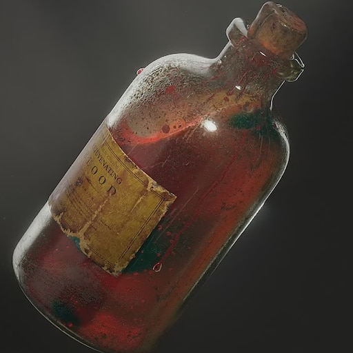

# Vial of Gradual Healing Blood

## Desc

Special blood invented by Veronica Reddington. Heals wounds and can cure a spore infection.

The process of creating Healing blood is a closely guarded secret of House Reddington, as it is Reddwall's largest export. During the spore epidemic, healing blood was the only known way of curing the spore infection, greatly increasing the political power of House Reddington.

## Info

|             Name             | # | Class |    Effect    |  Tier  | Durability |  LB  | Value |
| :---------------------------: | :-: | :---: | :----------: | :-----: | :--------: | :--: | :---: |
| Vial of Gradual Healing Blood | 1 |      | Gradual Heal | Mundane |            | 0.25 | 50 bc |

## Effects

| Name         |                                                                                   Effect                                                                                   | Duration | Tier Required |
| :----------- | :------------------------------------------------------------------------------------------------------------------------------------------------------------------------: | :------: | :-----------: |
| Gradual Heal | Minor injuries heal in a short rest. Medium injuries heal durning a long rest. A stabilized Serious injuries heal over a 24 hour rest. Cannot effect higher tier injuries. |          |       2       |
