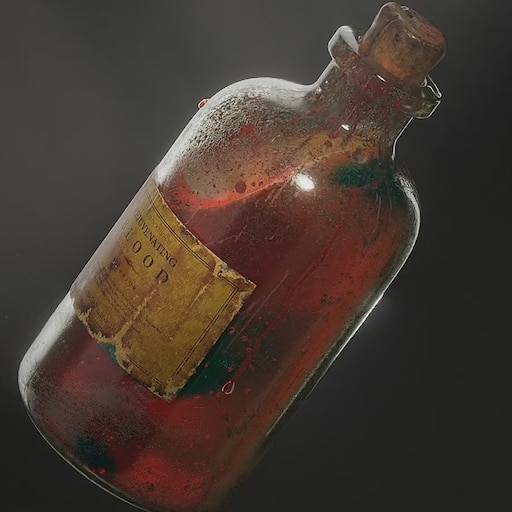

# Vial of Minor Healing Blood

Special blood invented by Veronica Reddington. Heals wounds and can cure a spore infection.

The process of creating Healing blood is a closely guarded secret of House Reddington, as it is Reddwall's largest export. During the spore epidemic, healing blood was the only known way of curing the spore infection, greatly increasing the political power of House Reddington.

|            Name            | # |   Effects   |  LB  | Value |
| :-------------------------: | :-: | :--------: | :--: | :---: |
| Vial of Minor Healing Blood | 1 | Minor Heal | 0.25 | 50 bc |

## Effects

| Name       |                                                                                                                               Desc                                                                                                                               | Duration | Source |
| :--------- | :----------------------------------------------------------------------------------------------------------------------------------------------------------------------------------------------------------------------------------------------------------------: | :------: | :-----------: |
| Minor Heal | Removes a minor or lesser injury. For a higher tier injury, reduce the dice penalty of the injury by 1. Injury remains at its current tier. Further minor heals have no effect. The higher tier injury requires the appropriate heal tier to completely remove it. |          |       2       |
