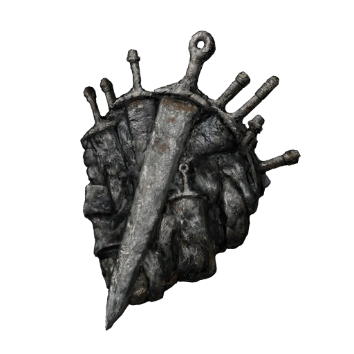

# Arsenal Charm +1

## Desc

An iron charm that resembles a mass of weaponry.

Greatly boosts maximum equipment load.

This talisman was derived from an unusual greatsword, once wielded by a hero hungry for vengeance.

## Item

| Name | # | Class | Effect | Tier | Durability | LB | Value |
| :--: | :-: | :---: | :----: | :--: | :--------: | :-: | :---: |
| Arsenal Charm +1 | 1 |  | Enhanced Lift | Flawless | 21/21 | 0.2 | ? |

## Effects

| Name | Effect | Duration | Tier Required |
| :--- | :----: | :------: | :-----------: |
| Enhanced Lift | +2d6 to Lift. | Indefinite | 4 |
