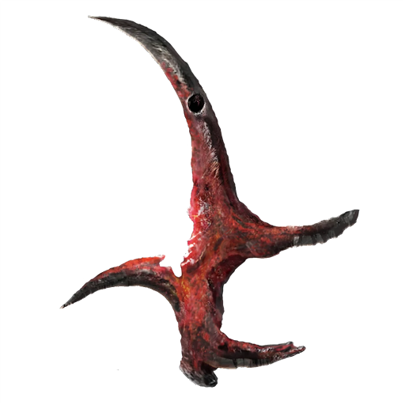

# Assassin's Crimson Talisman

|             Name             | # |  Effects  | LB | Value | Description                                             |
| :--------------------------: | :-: | :--------: | :-: | :---: | ------------------------------------------------------- |
| Assassin's Crimson Talisman | 1 | Life Leech | 0.2 |   ?   | An assassin's dagger, misshapen and stained in crimson. |

## Effects

| Name       |                     Desc                     |   Duration   |            Source            |
| :--------- | :------------------------------------------: | :-----------: | :--------------------------: |
| Life Leech | Sneak attacks trigger an Minor Heal to self. | Instantaneous | Assassin's Crimson Talisman |
