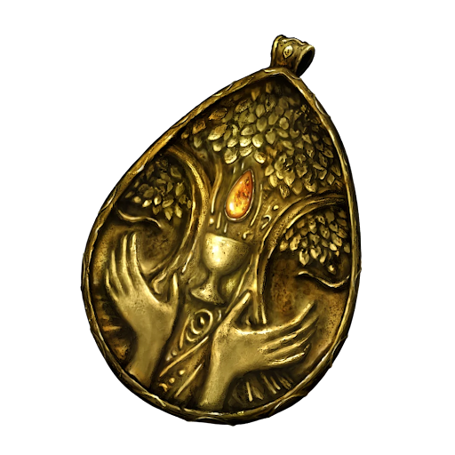

# Blessed Dew Talisman

It is the common knowledge that the dew of the morning has special healing properties. This amulet is crafted with condensed morning dew, allowing it to provide subtle mending properties to those that wear it. A favorite of explorers and travelers.

|         Name         | # |     Effect     | LB | Value |
| :------------------: | :-: | :-------------: | :-: | :---: |
| Blessed Dew Talisman | 1 | Gradual Healing | 0.2 |   ?   |

## Effects

| Name                   |                                                                                   Effect                                                                                   |  Duration  | Source |
| :--------------------- | :------------------------------------------------------------------------------------------------------------------------------------------------------------------------: | :--------: | :-----------: |
| Continous Gradual Heal | Minor injuries heal in a short rest. Medium injuries heal durning a long rest. A stabilized Serious injuries heal over a 24 hour rest. Cannot effect higher tier injuries. | Indefinite |       6       |
