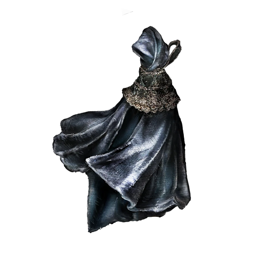

# Concealing Veil

Talisman put together from dark cloth, with a lustrous sheen.

Conceals the wearer's presence, becoming slightly transparent at will.

A common talisman of assassins.

|      Name      | # |          Effect          | LB | Value |
| :-------------: | :-: | :----------------------: | :-: | :---: |
| Concealing Veil | 1 | Minorly Enhanced Stealth | 0.2 |   ?   |

## Effects

| Name                     |      Effect      |  Duration  | Source |
| :----------------------- | :--------------: | :--------: | :-----------: |
| Minorly Enhanced Stealth | +1d6 to Stealth. | Indefinite |       2       |
