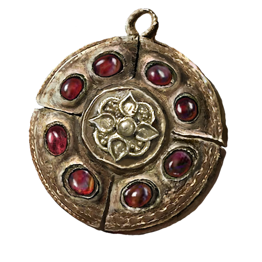

# Name

## Desc

A medallion with Crimson amber inlaid. A precious talisman for protecting one's life.

Boosts maximum vitality.

## Item

|         Name         | # |      Effect      | LB | Value |
| :------------------: | :-: | :---------------: | :-: | :---: |
| Crimson Medallion +1 | 1 | Enhanced Vitality | 0.2 |   ?   |

## Effects

| Name              |                     Effect                     |    Duration    | Tier Required |
| :---------------- | :--------------------------------------------: | :------------: | :-----------: |
| Enhanced Vitality | Reduce up to 2d6 of total injury penalty dice. | While equipped |       6       |
