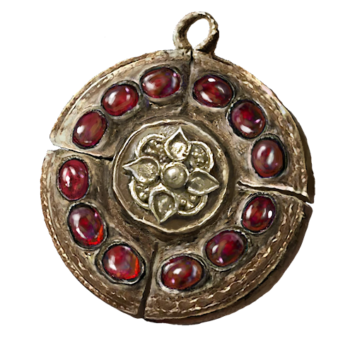

# Crimson Medallion +2

A medallion with Crimson amber inlaid. A precious talisman for protecting one's life. An essential tool of kings and queens looking for an edge in surviving assassination attempts.

Greatly boosts maximum vitality.

|         Name         | # |         Effects         | LB | Value |
| :------------------: | :-: | :---------------------: | :-: | :---: |
| Crimson Medallion +2 | 1 | Great Enhanced Vitality | 0.2 |   ?   |

## Effects

| Name                      |                     Desc                     |    Duration    | Source |
| :------------------------ | :--------------------------------------------: | :------------: | :-----------: |
| Greatly Enhanced Vitality | Reduce up to 3d6 of total injury penalty dice. | While equipped |       8       |
