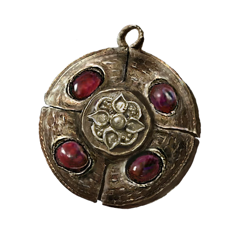

# Crimson Medallion

## Desc

A medallion with Crimson amber inlaid. A precious talisman for protecting one's life.

Minorly boosts maximum vitality.

## Info

|       Name       | # | Class |         Effect         |   Tier   | Durability | LB | Value |
| :---------------: | :-: | :---: | :---------------------: | :------: | :--------: | :-: | :---: |
| Crimson Medallion | 1 |      | Minor Enhanced Vitality | Flawless |   30/30   | 0.2 |   ?   |

## Effects

| Name                      |                     Effect                     |    Duration    | Tier Required |
| :------------------------ | :--------------------------------------------: | :------------: | :-----------: |
| Minorly Enhanced Vitality | Reduce up to 1d6 of total injury penalty dice. | While equipped |       4       |
