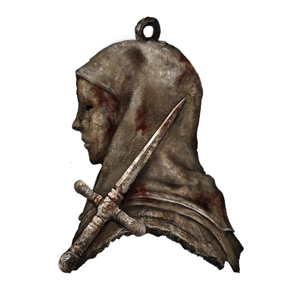

# Dagger Talisman

A talisman depicting a dagger and a surgeon.

Enhances critical hits for sneak attack and incapacitated opponents.

The white-garbed field surgeons come to the aid of friend and foe alike by dealing a final deadly thrust to spare them from the prolonged agony of a mortal wound. A sense of mercy is a catalyst for bloodlust.

|      Name      | # |      Effects      | LB | Value |
| :-------------: | :-: | :---------------: | :-: | :---: |
| Dagger Talisman | 1 | Enhanced Critical | 0.2 |   ?   |

## Effects

| Name              |                             Desc                             |    Duration    | Source |
| :---------------- | :------------------------------------------------------------: | :------------: | :-----------: |
| Enhanced Critical | +1 automatic win to sneak attacks and incapacitated opponents. | While equipped |       6       |
