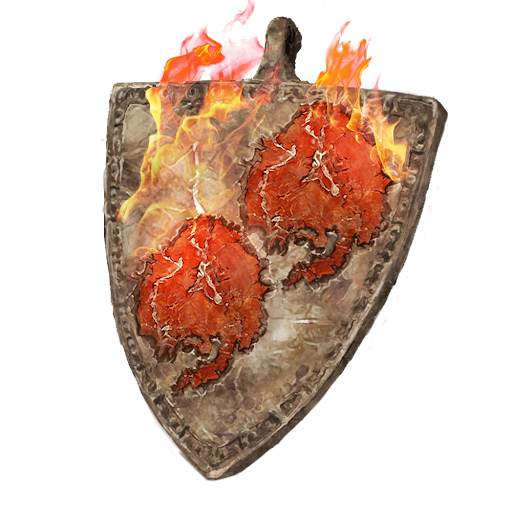

# Fire Dragon Scale Talisman +1

## Desc

A metal talisman with twin symbols evoking the image of fire on it. This more powerful Runecrafted item provides substantial protection against fire and heat to those that wear it.

## Item

|             Name             | # |         Effect         | LB | Value |
| :---------------------------: | :-: | :--------------------: | :-: | :---: |
| Fire Dragon Scale Talisman +1 | 1 | Medium Fire Resistance | 0.2 |   ?   |

## Effects

| Name                   |                     Effect                     |    Duration    | Tier Required |
| :--------------------- | :---------------------------------------------: | :------------: | :-----------: |
| Medium Fire Resistance | -2 to victory levels received from Fire damage. | While equipped |       5       |
