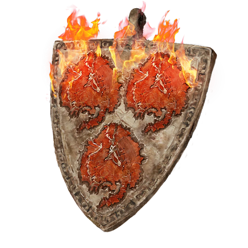

# Fire Dragon Scale Talisman +2

|             Name             | # |        Effects        | LB | Value | Description                                                                                                                                                                                                                                           |
| :---------------------------: | :-: | :-------------------: | :-: | :---: | ----------------------------------------------------------------------------------------------------------------------------------------------------------------------------------------------------------------------------------------------------- |
| Fire Dragon Scale Talisman +2 | 1 | Major Fire Resistance | 0.2 |   ?   | A metal talisman with three symbols evoking the image of fire on it. This Runecrafted item gives its wearer nigh immunity to most common blazes, allowing its wearer to do some things like stand in fires or eat burning rods without being injured. |

## Effects

| Name                  |                      Desc                      |    Duration    |            Source            |
| :-------------------- | :---------------------------------------------: | :------------: | :---------------------------: |
| Major Fire Resistance | -3 to victory levels received from Fire damage. | While equipped | Fire Dragon Scale Talisman +2 |
