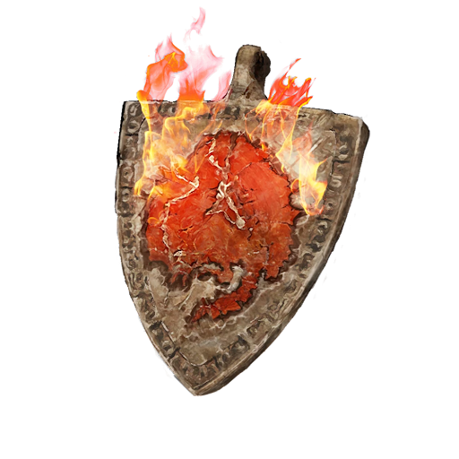

# Fire Dragon Scale Talisman

A metal talisman with a symbol evoking the image of fire on it. This Runecrafted item provides resistance to heat and fire to those that wear it.

|            Name            | # |        Effects        | LB | Value |
| :------------------------: | :-: | :-------------------: | :-: | :---: |
| Fire Dragon Scale Talisman | 1 | Minor Fire Resistance | 0.2 |   ?   |

## Effects

| Name                  |                     Desc                     |    Duration    | Source |
| :-------------------- | :---------------------------------------------: | :------------: | :-----------: |
| Minor Fire Resistance | -1 to victory levels received from Fire damage. | While equipped |       3       |
