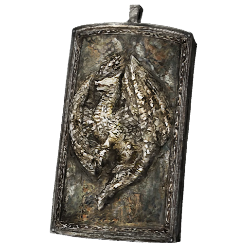

# Great Steel Dragon Scale Talisman

## Desc

A larger wrought iron talisman in the shape of a greatshield with an imposing Steel Dragon emblazoned on its face. These talismans are extremely rare and expensive to make, meaning that only the upper echelons of society have access to them. Often worn by extremely wealthy merchants, royalty and even the Emperor, these powerful Runecrafted items often never see the battlefield they were intended for.

## Item

|               Name               | # | Class |                                                   Effect                                                   |   Tier   | Durability | LB | Value |
| :-------------------------------: | :-: | :---: | :---------------------------------------------------------------------------------------------------------: | :-------: | :--------: | :-: | :---: |
| Great Steel Dragon Scale Talisman | 1 |      | Extreme Hew Resistance, Extreme Slash Resistance, Extreme Bludgeon Resistance, Extreme Shockwave Resistance | Legendary |   42/42   | 0.2 |   ?   |

## Effects

| Name                         |                        Effect                        |    Duration    | Tier Required |
| :--------------------------- | :--------------------------------------------------: | :------------: | :-----------: |
| Extreme Hew Resistance       |    -4 to victory levels received from Hew damage.    | While equipped |       9       |
| Extreme Slash Resistance     |   -4 to victory levels received from Slash damage.   | While equipped |       9       |
| Extreme Pierce Resistance    |  -4 to victory levels received from Pierce damage.  | While equipped |       9       |
| Extreme Bludgeon Resistance  | -4 to victory levels received from Bludgeon damage. | While equipped |       9       |
| Extreme Shockwave Resistance | -4 to victory levels received from Shockwave damage. | While equipped |       9       |
