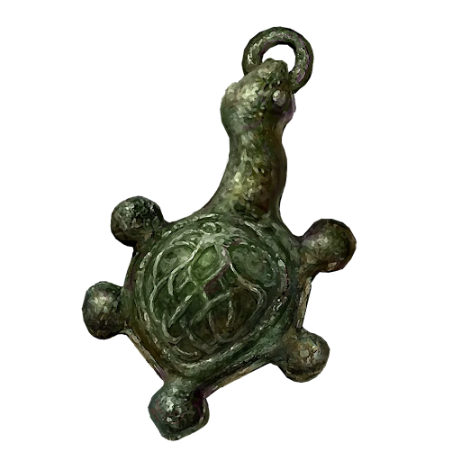

# Green Turtle Talisman

|         Name         | # |          Effects          | LB | Value | Description                                                                                                                                                                                                                                                                                                        |
| :-------------------: | :-: | :------------------------: | :-: | :---: | ------------------------------------------------------------------------------------------------------------------------------------------------------------------------------------------------------------------------------------------------------------------------------------------------------------------ |
| Green Turtle Talisman | 1 | Minorly Enhanced Endurance | 0.2 |   ?   | A talisman in the shape of a green turtle.  Minorly raises stamina recovery speed.  Turtles are known as a nutritious ingredient, symbolic of inexhaustible power.  However, those who hold turtles to be wise creatures consider the practice of eating their meat to be barbarous. |

## Effects

### Enhanced Endurance

+1 to Endurance skill.Effects

| Name                       |        Desc        |    Duration    |        Source        |
| :------------------------- | :----------------: | :------------: | :-------------------: |
| Minorly Enhanced Endurance | +1d6 to Endurance. | While equipped | Green Turtle Talisman |
