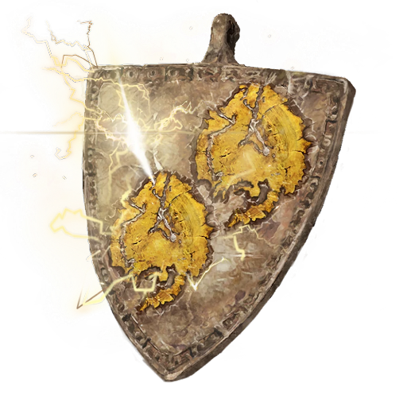

# Lightning Dragon Scale Talisman +1

## Desc

A metal talisman with two symbols evoking the image of lightning on it. This more powerful Runecrafted item provides substantial protection against electricity and shocks to those that wear it.

## Item

| Name | # | Class | Effect | Tier | Durability | LB | Value |
| :--: | :-: | :---: | :----: | :--: | :--------: | :-: | :---: |
| Lightning Dragon Scale Talisman +1 | 1 |  | Medium Lightning Resistance | Exquisite | 27/27 | 0.2 | ? |

## Effects

| Name | Effect | Duration | Tier Required |
| :--- | :----: | :------: | :-----------: |
| Medium Electric Resistance | -2 to victory levels received from Electric damage. | While equipped | 5 |
