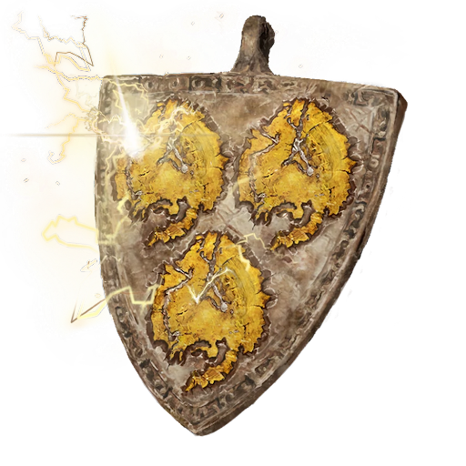

# Lightning Dragon Scale Talisman +2

A metal talisman with three symbols evoking the image of lightning on it. This Runecrafted item gives its wearer nigh immunity to most common shocks, allowing its wearer to do some things like be struck by lightning with low risk of being injured.

|                Name                | # |           Effect           | LB | Value |
| :--------------------------------: | :-: | :------------------------: | :-: | :---: |
| Lightning Dragon Scale Talisman +2 | 1 | Major Lightning Resistance | 0.2 |   ?   |

## Effects

| Name                      |                       Effect                       |    Duration    | Source |
| :------------------------ | :-------------------------------------------------: | :------------: | :-----------: |
| Major Electric Resistance | -3 to victory levels received from Electric damage. | While equipped |       7       |
