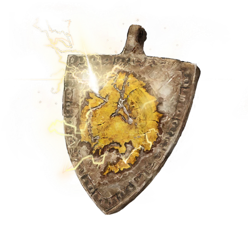

# Lightning Dragon Scale Talisman

## Desc

A metal talisman with a symbol evoking the image of lightning on it. This Runecrafted item provides some resistance to electricity and shocks to those that wear it.

## Item

|              Name              | # |           Effect           | LB | Value |
| :-----------------------------: | :-: | :------------------------: | :-: | :---: |
| Lightning Dragon Scale Talisman | 1 | Minor Lightning Resistance | 0.2 |   ?   |

## Effects

| Name                      |                       Effect                       |    Duration    | Tier Required |
| :------------------------ | :-------------------------------------------------: | :------------: | :-----------: |
| Minor Electric Resistance | -1 to victory levels received from Electric damage. | While equipped |       3       |
