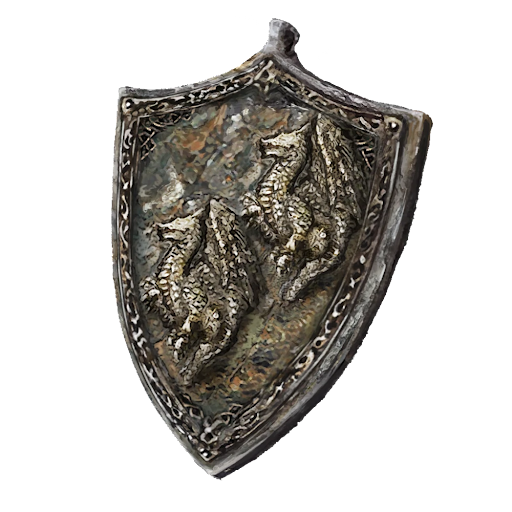

# Steel Dragon Scale Talisman +1

A wrought iron talisman made with the visage of twin Steel Dragons. More rare and powerful than its lesser counterpart, this talisman remains a favorite of professional men-at-arms and experienced mercenaries.

|              Name              | # |                                                 Effect                                                 | LB | Value |
| :----------------------------: | :-: | :-----------------------------------------------------------------------------------------------------: | :-: | :---: |
| Steel Dragon Scale Talisman +1 | 1 | Medium Hew Resistance, Medium Slash Resistance, Medium Bludgeon Resistance, Medium Shockwave Resistance | 0.2 |   ?   |

## Effects

| Name                        |                        Effect                        |    Duration    | Source |
| :-------------------------- | :--------------------------------------------------: | :------------: | :-----------: |
| Medium Hew Resistance       |    -2 to victory levels received from Hew damage.    | While equipped |       5       |
| Medium Slash Resistance     |   -2 to victory levels received from Slash damage.   | While equipped |       5       |
| Medium Pierce Resistance    |  -2 to victory levels received from Pierce damage.  | While equipped |       5       |
| Medium Bludgeon Resistance  | -2 to victory levels received from Bludgeon damage. | While equipped |       5       |
| Medium Shockwave Resistance | -2 to victory levels received from Shockwave damage. | While equipped |       5       |
