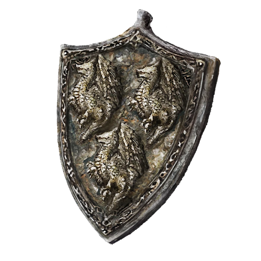

# Steel Dragon Scale Talisman +2

|              Name              | # |                                               Effects                                               | LB | Value | Description                                                                                                                                                                                                                                                               |
| :----------------------------: | :-: | :-------------------------------------------------------------------------------------------------: | :-: | :---: | ------------------------------------------------------------------------------------------------------------------------------------------------------------------------------------------------------------------------------------------------------------------------- |
| Steel Dragon Scale Talisman +2 | 1 | Major Hew Resistance, Major Slash Resistance, Major Bludgeon Resistance, Major Shockwave Resistance | 0.2 |   ?   | A wrought iron talisman made with the visage of three Steel Dragons. This item is quite rare and powerful, requiring a fair amount of labor and wealth to create. As such it is usually only seen worn by Knights of the Nobility and well established mercenary leaders. |

## Effects

| Name                       |                         Desc                         |    Duration    |             Source             |
| :------------------------- | :--------------------------------------------------: | :------------: | :----------------------------: |
| Major Hew Resistance       |    -3 to victory levels received from Hew damage.    | While equipped | Steel Dragon Scale Talisman +2 |
| Major Slash Resistance     |   -3 to victory levels received from Slash damage.   | While equipped | Steel Dragon Scale Talisman +2 |
| Major Pierce Resistance    |  -3 to victory levels received from Pierce damage.  | While equipped | Steel Dragon Scale Talisman +2 |
| Major Bludgeon Resistance  | -3 to victory levels received from Bludgeon damage. | While equipped | Steel Dragon Scale Talisman +2 |
| Major Shockwave Resistance | -3 to victory levels received from Shockwave damage. | While equipped | Steel Dragon Scale Talisman +2 |
