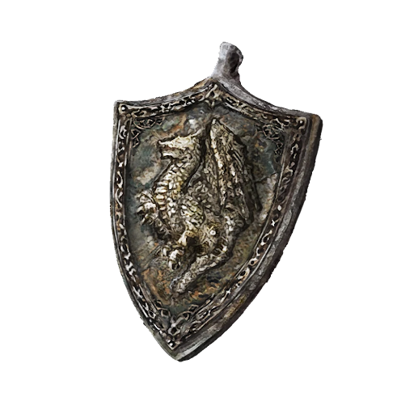

# Steel Dragon Scale Talisman

## Desc

A wrought iron talisman made with the visage of a mighty Steel Dragon. While quite common among defensive Runecrafted items, it is still a boon to any common soldier or mercenary.

## Item

| Name | # | Class | Effect | Tier | Durability | LB | Value |
| :--: | :-: | :---: | :----: | :--: | :--------: | :-: | :---: |
| Steel Dragon Scale Talisman | 1 |  | Minor Hew Resistance, Minor Slash Resistance, Minor Bludgeon Resistance, Minor Shockwave Resistance | Excellent | 21/21 | 0.2 | ? |

## Effects

| Name | Effect | Duration | Tier Required |
| :--- | :----: | :------: | :-----------: |
| Minor Hew Resistance | -1 to victory levels received from Hew damage. | While equipped | 3 |
| Minor Slash Resistance | -1 to victory levels received from Slash damage. | While equipped | 3 |
| Minor Pierce Resistance | -1 to victory levels received from Pierce damage. | While equipped | 3 |
| Minor Bludgeon Resistance | -1 to victory levels received from Bludgeon damage. | While equipped | 3 |
| Minor Shockwave Resistance | -1 to victory levels received from Shockwave damage. | While equipped | 3 |
