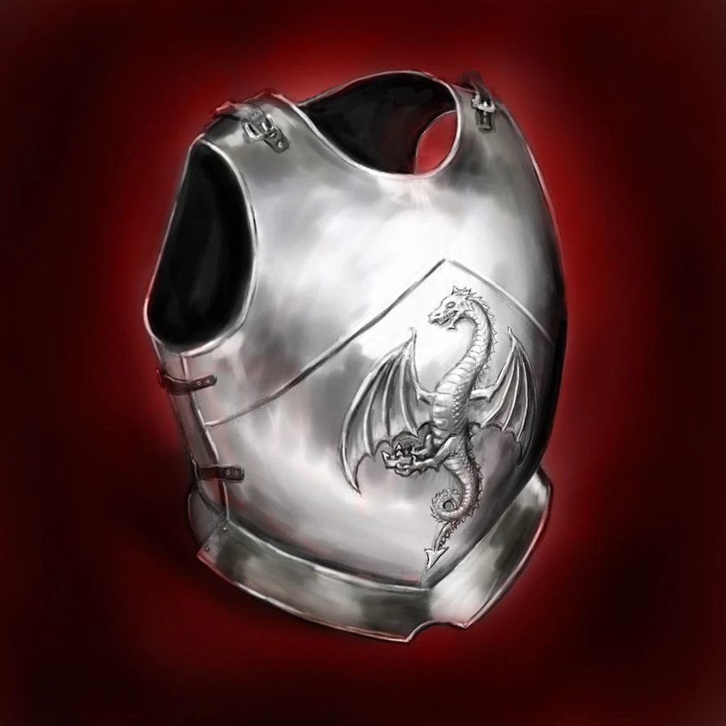

# Dragonguard

This breastplate has a dragon motif etched into its design. Created for a dragon fighting hero of Reddland, who's name has been lost to time. This armor provides good protection for the wearer's vital organs.

|    Name    | # |                                  Effect                                  | LB |   Value   |
| :---------: | :-: | :-----------------------------------------------------------------------: | :-: | :-------: |
| Dragonguard | 1 | Body Armor, Phy. Def. 2.01, Dragon Threat Sense, Dragon Breath Resistance | 23 | 603.24 bc |

## Effects

| Name                     |                                        Desc                                        |    Duration    | Source |
| :----------------------- | :-----------------------------------------------------------------------------------: | :------------: | :-----------: |
| Dragon Threat Sense      |     The character gets an uneasy feeling when there are draconic creatures near.     | While equipped |       3       |
| Dragon Breath Resistance | Minor Resistance vs dragon elemental attacks (Dragonfire, Dragontide, Soulfire, ect). | While equipped |       5       |
