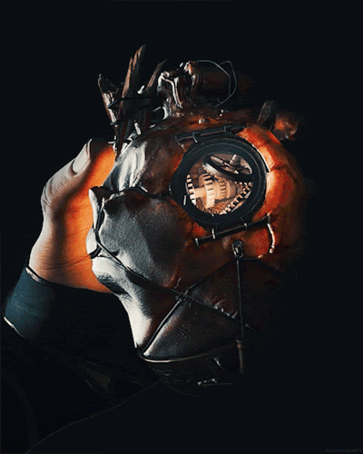

# Mechanical Heart

## Desc

"With this Heart, I will hear many secrets…" - Unknown

Said to have been designed by the lord of Tuntin, who subsequently died in the fire that burned his estate to the ground. A vessel designed to contain a soul, it is used to help uncover runecrafts and other supernatural events throughout Terra.

## Item

| Name | # | Class | Effect | Tier | Durability | LB | Value |
| :--: | :-: | :---: | :----: | :--: | :--------: | :-: | :---: |
| Mechanical Heart | 1 |  | Phenomena Detection, Forbidden Whispers | Exquisite |  | 1 | ? |

## Effects

| Name | Effect | Duration | Tier Required |
| :--- | :----: | :------: | :-----------: |
| Phenomena Detection | Beats and lights up when turned towards supernatural phenomena in an area. Beats faster the closer it is.                                                                                                                                                                                                                    |  | 5 |
| Forbidden Whispers  | When one squeezes the Heart, it whispers secrets directly into their mind concerning the current area, as it senses information about the world beyond mortal recognition. When the Heart is pointed at a person, it reveals secrets about them. Roll a destiny roll (a d20) to determine the level of information obtained. |  | 5 |
