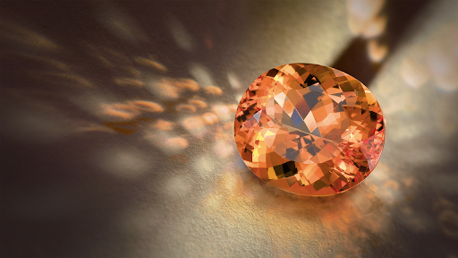

# Petty Brightstone

Brightstone is a rare gem that can hold light. The only place it can be found is near Crossroads, where it is said that Bright Lord fell after taking a hit from Amon during the Great Betrayal. The finer and more precisely the gem is cut the more light it can hold.

|       Name       | # |    Effect    | LB | Value |
| :---------------: | :-: | :-----------: | :-: | :---: |
| Petty Brightstone | 1 | Light Storage | 0.1 |   ?   |

## Effects

| Name          |                                                   Desc                                                   | Duration | Source |
| :------------ | :---------------------------------------------------------------------------------------------------------: | :------: | :-----------: |
| Light Storage | Holds 1 Magic Resource worth of light. Can be recharged in Sunlight. Light slowly dissipates from this gem. |          |       3       |
