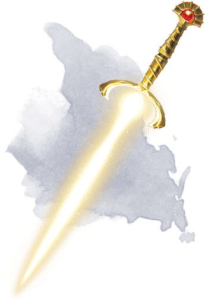

# Adversary - Damaged

|        Name        | # |             Effect             | LB | Value | Description                                                                                                                                                                                                                                                                                                                                                                                                                                                                                                                                                                                                                                                                                                                                                                                                                                                                                                                                           |
| :-----------------: | :-: | :-----------------------------: | :-: | :---: | :---------------------------------------------------------------------------------------------------------------------------------------------------------------------------------------------------------------------------------------------------------------------------------------------------------------------------------------------------------------------------------------------------------------------------------------------------------------------------------------------------------------------------------------------------------------------------------------------------------------------------------------------------------------------------------------------------------------------------------------------------------------------------------------------------------------------------------------------------------------------------------------------------------------------------------------------------- |
| Adversary - Damaged | 1 | Spellcasting Focus, Light Bound | 1 |   ?   | "Awake, arise, or be forever Fallen…" - Words of the Bright Lord  A masterfully crafted golden sword hilt, that appears to be damaged from a tremendous impact, leaving the hilt crack and leaking light. Used as a Radiance Spellcasting Focus to focus ones abilities, generally in the shape of a sword blade.  Sword of Luc Lightbringer. The hilt acts as a Miracles focus, allowing for devastating radiant attack. Luc has had this sword his entire life, a mysterious gift from when he was too young to remember. In many ways, this sword and Luc are one in the same. Elegant, bright, and extremely dangerous. Luc has spent his entire entire life learning the abilities of this artifact, though even he does not fully understand the weapon…  This sword was used in the execution of Helena by Uhtred Storm at Luc's order, though it was only used to subdue her and did not deal the final blow. |

## Effects

| Name        |                                                  Effect                                                  |   Duration   | Source |
| :---------- | :-------------------------------------------------------------------------------------------------------: | :-----------: | :----: |
| Light Bound | This weapon is physical light, and can be absorbed and summoned by a those with the Radiance magic skill. | Instantaneous |        |
