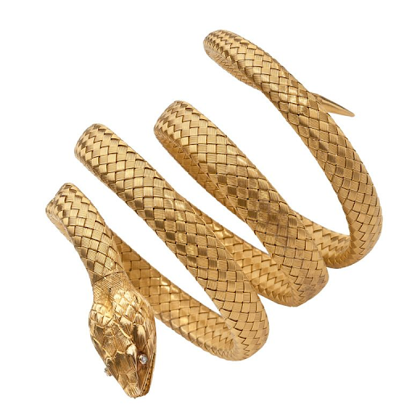

# Asclepius

## Desc

This mastercrafted 5 foot golden snake was crafted by those that worshiped the Great Leviathan.

## Info

|   Name   | # |                                 Class                                 |              Effect              |    Tier    | Durability | LB | Value |
| :-------: | :-: | :--------------------------------------------------------------------: | :------------------------------: | :---------: | :--------: | :-: | :---: |
| Asclepius | 1 | Medium Spear, Thrown Medium Spear, Large Spear, Thrown Large Spear, Longspear, Whip | Metal Feeding, Command Asclepius | Mastercraft |   33/33   | 3 |   ?   |

## Effects

| Name              |                                                                                                      Effect                                                                                                      | Duration | Tier Required |
| :---------------- | :---------------------------------------------------------------------------------------------------------------------------------------------------------------------------------------------------------------: | :------: | :-----------: |
| Metal Feeding     |                                       To repair, item can feed on metal. Different amounts result in different levels of repair and time needed to complete these repairs.                                       |          |       6       |
| Command Asclepius | By holding and speaking the command word "Asclepius" the user may instruct this Runecraft to perform various simple actions. "Asclepius, turn into a whip, or short spear." or Asclepius, attack those soldiers." |          |       4       |
