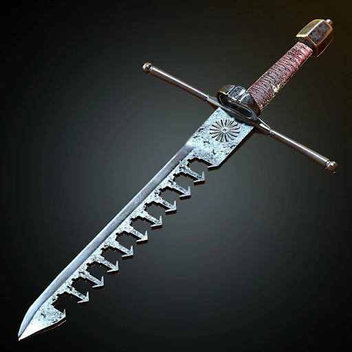

# Asher's Arms Swordbreaker

|           Name           | # |                                                       Effects                                                       | LB | Value | Description                                                                                                                                                                                                                                                                                                                                                                                                                                                                        |
| :-----------------------: | :-: | :------------------------------------------------------------------------------------------------------------------: | :-: | :---: | ---------------------------------------------------------------------------------------------------------------------------------------------------------------------------------------------------------------------------------------------------------------------------------------------------------------------------------------------------------------------------------------------------------------------------------------------------------------------------------- |
| Asher's Arms Swordbreaker | 1 | Fine Small Slashing Blade, Shoddy Small Piercing Blade, Shoddy Thrown Small Pierce Melee (+0) (One-handed), Thrown Small Pierce Melee (+0) (Dual-wielded), Swordbreaker Blade Catch | 1 |   ?   | A fine swordbreaker purchased from Asher’s Arm, a well regarded establishment in Reddwall known for their grayish blue steel. Swordbreakers were a favorite weapon of Lord Flint Reddington. He commissioned many swordbreakers just like this one for use in dueling.  Swordbreakers, often wielded offhand to a main hand sword. They are designed to catch and bind the opponent's blade, leaving the opponent open for a decisive attack from the main hand weapon. |

## Effects

| Name                     |                                                                                                                                           Desc                                                                                                                                           | Duration |          Source          |
| :----------------------- | :--------------------------------------------------------------------------------------------------------------------------------------------------------------------------------------------------------------------------------------------------------------------------------------: | :------: | :-----------------------: |
| Swordbreaker Blade Catch | Any weapon that could reasonably be caught in the swordbreaker can be caught with a Lvl 1 victory, entering into Close Quarters combat. The opponent's weapon is usable while bound. Your main hand weapon (Small, Medium, or Large) can be used in this Close Quarters combat scenario. |          | Asher's Arms Swordbreaker |
