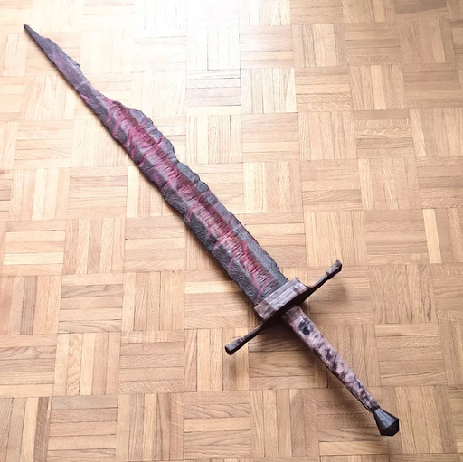

# Char

## Desc

"It has been in the family for a bit, passed down from father to son. It’ll be yours one day junior. Who knows, you might need it someday." -Destin Shaffer Sr.

An apparently mundane greatsword with a partially shattered tip “acquired” and used by Destin Shaffer. Destin took this sword when he left his mother and father. Taken because it was the least valuable weapon at his parents' blacksmith shop as his guilt prevented him from taking anything nicer. He always wondered why his step-father kept the hunk of junk leaning up against the wall.

Destin used this blade in his time as a mercenary. He had plenty of opportunities to claim more elegant weapons from fallen opponents, though he could never part with the blade.

During Destin's confrontation with the Demon Helena, he sacrificed the damaged blade for one more powerful strike to in a desperate attempt defend the fleeing prisoner’s and his friends. The sword shattered, though somehow managed to hold itself together, surging with red heat visible through the cracks. Recently, Destin has discovered that the weapon seems capable of repairing itself under extreme heat.

Shattered and broken, Destin continues to carry this blade.

## Info

| Name | # |                   Class                   |           Effect           |  Tier  | Durability | LB | Value |
| :--: | :-: | :---------------------------------------: | :-------------------------: | :-----: | :--------: | :-: | :---: |
| Char | 1 | Thrusting Reach Sword, Slashing Reach Sword | Fire Repair and Enhancement | Damaged |    6/6    | 6 |   ?   |

## Effects

| Name                        |                                                                                                  Effect                                                                                                  | Duration | Tier Required |
| :-------------------------- | :-------------------------------------------------------------------------------------------------------------------------------------------------------------------------------------------------------: | :------: | :-----------: |
| Fire Repair and Enhancement | Weapons repairs in intense fires. If fully repaired and is exposed to increasily intense flames, it will become a higher tier item. Each time it is upgraded, a more intense fire is required upgrade it. |          |      -3      |
