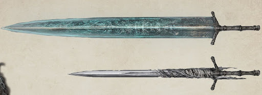

# Dancing Moonlight

## Desc

"Ah, you were at my side all along. My true mentor. My guiding moonlight." - Unknown

A mythic arcane longsword discovered by the first Sirens who first inhabited what is known as Reddland today. Said to be a sign of divine favor to those chosen by the Moon Presence of Terra. As a manifestation of the Moon Presence on Terra, the wielder gains access to the wisdom and power of the moon presence.

When moonlight dances around the sword, and it channels the abyssal cosmos, its great blade will hurl a shadowy lightwave. Few have ever set eyes on the great blade, and whatever guidance it has to offer, it seems to be of a very private, elusive sort.

Princess Vex'ahlia Reddington was gifted this sword upon her return to Reddland by her mother, who claimed it was her birth right. Lady Reddington used to tell tales of Vex'ahlia's birth. Lady Reddington wanted nothing more than a child, so when her medical and academic knowledge failed her, she prayed to the Moon Presence to protect the unborn child within her. Vex'ahlia was born with white hair the color of the full moon. One night when Lady Veronica went to check on the baby Vex'ahlia, this sword was leaning up against her crib playing the most wonderful lullaby she'd ever heard.

## Info

|       Name       | # |                                                                      Class                                                                      |                           Effect                           |   Tier   | Durability | LB | Value |
| :---------------: | :-: | :----------------------------------------------------------------------------------------------------------------------------------------------: | :--------------------------------------------------------: | :------: | :--------: | :-: | :---: |
| Dancing Moonlight | 1 | Artifact Large Thrusting Sword, Artifact Large Slashing Sword, Artifact Reach Thrusting Sword, Artifact Reach Slashing Sword, Spellcasting Focus | Moonlight Greatsword, Indestructible, Blessing of the Moon | Artifact |   48/48   | 3 |   ?   |

## Effects

| Name                 |                                                                                                                                         Effect                                                                                                                                         | Duration | Tier Required |
| :------------------- | :------------------------------------------------------------------------------------------------------------------------------------------------------------------------------------------------------------------------------------------------------------------------------------: | :------: | :-----------: |
| Moonlight Greatsword |                                        Just by thought, this ancient sword wreathed in moonlight, becoming a greatsword wreathed in moonlight. While active, it becomes a greatsword and now additionally deals radiant damage.                                        |          |       2       |
| Indestructible       |                                                                                                                            This item can't lose durability.                                                                                                                            |          |       1       |
| Blessing of the Moon |                                                           INT is set to level 2. While bound to this weapon, gain the following disabling: "I hear the sword whispering its secrets to me, and I must know them"                                                           |          |       8       |
| Binding of the Moon  | This weapon can only be picked up by those who sing (out loud or in their head) the Lullaby of the Moon. If the weapon is held for a fortnight, the weapon is bound to the users, severing the bond with the previous bearer. The bearer can now dismiss and summon the blade at will. |          |       8       |
