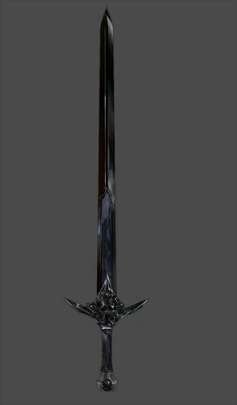

# Echo

"What is a myth? An echo of the past in the future. I can hear it dear sister, can't you…" - Lord Maxwell Reddington

The arming sword of Lord Maxwell Reddington, taken from the crypt underneath Castle Tearstone.

Lord Maxwell Reddington was heir to House Reddington and to the Kingdom of Reddland. Maxwell was an academic of Byrgenwerth, like his sister Veronica, and was fascinated by the ancient culture of the Siren’s who used to call Reddwall their own. He spent much of his time and dowry funding expeditions into the ancient Siren catacombs that Reddwall stand up today. On one of these expeditions with his younger sister Lady Veronica Reddington, they discovered something deep within the catacombs. Maxwell returned with this sword and Veronica shortly after invented the first healing bloods of Reddwall.

After that fateful day, Maxwell began to worship the Moon Presence. On a diplomatic mission to Crossroads with his sister, Maxwell had an apparent mental breakdown. He raved and blasphemed the Bright Lord in front of the Emperor, and was sentenced to death for his heresy. Veronica was held hostage and war between Reddland and the Empire almost erupted. However, an outlaw pirate Lord known as the Laughing Storm blockaded the Iris Sea and promised to burn and pillage all vessels until Veronica was safely released.

In the end, peace was agreed upon between the two powers. Veronica was barren, so it was agreed the next heir of Reddwall would be bound to the next heir of the Dawn Empire, unifying countries in blood. The entire event was later known as “The Red Blasphemy”.

The Laughing Storm, one of the greatest pirate lords and outlaws to have ever lived, turned himself over to the Reddland navy voluntarily. Sentenced to death, he was pardoned by the now Lady Veronica Reddington for his efforts in her rescue but was indebted to serve Lady Veronica for the rest of his life. Flint Storm served faithfully as Veronica’s advisor and admiral of the Reddland Navy, until their eventual unexpected marriage.

Veronica and Flint tried for children many times, but tragedy struck every time. After years of trying, Veronica eventually bore a sickly heir, a daughter with hair as white as the full moons.

| Name | # |                                        Effect                                        | LB | Value |
| :--: | :-: | :----------------------------------------------------------------------------------: | :-: | :---: |
| Echo | 1 | Superior Medium Versatile Thrusting Sword, Superior Medium Versatile Slashing Sword | 2 |   ?   |

## Effects

| Name | Effect | Duration | Source |
| :--- | :----: | :------: | :-----------: |
