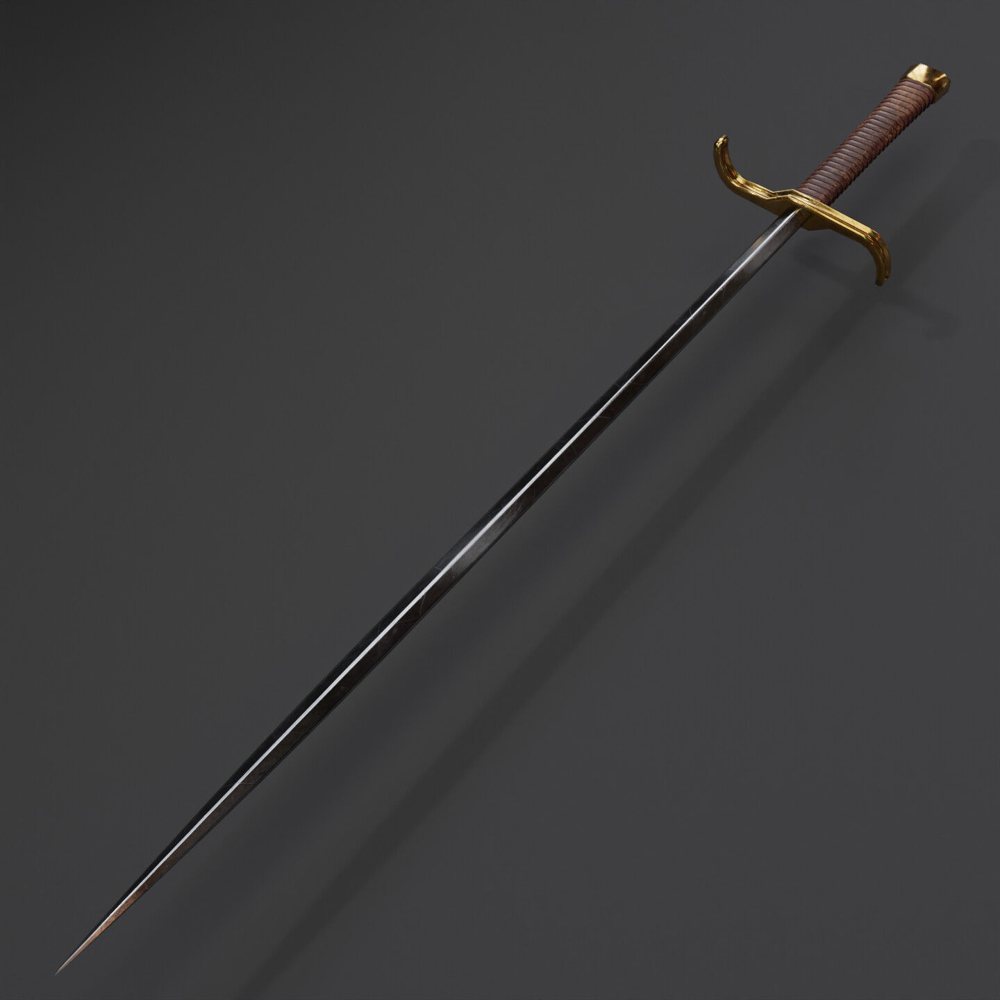

# Epilogue

## Desc

"There is no real ending. It's just a place where you stop the story."

This excellent slender bastard sword is perfectly balanced. Nimble, thin, and razor sharp, this is a fine sword.

A relatively unknown Runecraft to the wider populace, this sword is highly debated by scholars of war and Runecrafts. "Ending", "Epilogue", "The Last Word", "An Ending to things", ect… are all names for what scholars believe is the same sword recorded across many myths from various cultures, long into the past. Always described as a slender, long, graceful sword as easy to use in one hand as two. This sword seems to end up in the hands of ill fated rogues and rebels.

Killing with this weapon seems to mysteriously decapitate the victim's head from their bodies. In some tales it is only when the user of the sword deals a killing blow, while in older tales a single nick from the blade would lead to instant decapitation. Users report seeing flashes of the life they’ve cut off and all the generations in an instant.

 Appearing in various forms throughout history such as a rapier or slender long sword. This has led some scholars to argue that this sword is in fact multiple swords with similar effects. The Battle Scholars of the Dawn Empire had this weapon in their great collection in Crossroads long ago, and it was mysteriously lost. They recorded the weapon as only decapitating on a death blow, testing it on condemned criminals. Such a weak effect led to reduced research on the weapon while it was in their possession. However, they never were able to replicate its Runecraft, odd for such a weak effect. No weapon has ever been recorded as having a similar effect, leaving some scholars to ponder if there is more to this Runecraft…

## Item

|   Name   | # |                               Class                               | Effects |   Tier   | Durability | LB | Value |
| :------: | :-: | :---------------------------------------------------------------: | :-----: | :-------: | :--------: | :-: | :---: |
| Epilogue | 1 | Excellent Medium Versatile Thrusting Sword, Excellent Medium Versatile Slashing Sword | Ending | Excellent |   21/21   | 2 |   ?   |

## Effects

| Name   |                            Effect                            |   Duration   | Effect Slots |
| :----- | :----------------------------------------------------------: | :-----------: | :----------: |
| Ending | Creatures killed with this weapon are instantly decapitated. | Instantaneous |      1      |
