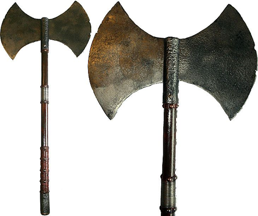

# Hew

## Desc

"When you chop wood, splinters fly."  - Anonymous

An unassuming double bladed, rusty, yet excellently crafted battleaxe both as versatile at chopping wood as chopping skulls.

Runecraft scholars have traced the origin of this axe to the first Fellkin who began harvesting the great iron woods of Reddland. Needing a tool that was both capable of felling the great iron woods and fending back the monstrous Leshens that roamed the forest, this weapon was forged.

## Item

| Name | # |                Effect                | LB | Value |
| :--: | :-: | :-----------------------------------: | :-: | :---: |
| Hew | 1 | Excellent Medium Hafted Axe, Splinter | 4 |   ?   |

## Effects

| Name     |                                                                           Effect                                                                           | Duration | Tier Required |
| :------- | :--------------------------------------------------------------------------------------------------------------------------------------------------------: | :------: | :-----------: |
| Splinter | Any weapon dice added to a combat roll are considered automatic wins when attacking a plant based creature (Leshens, Nature Dragons) or wooden structures. |          |       2       |
