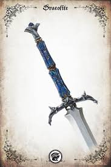

# Siruis's Sword

|      Name      | # |                         Effects                         | LB | Value | Description                                                                                                                                                                                                                                                                                                                                                                                        |
| :-------------: | :-: | :-----------------------------------------------------: | :-: | :---: | -------------------------------------------------------------------------------------------------------------------------------------------------------------------------------------------------------------------------------------------------------------------------------------------------------------------------------------------------------------------------------------------------- |
| Sirius’s Sword | 1 | Medium Pierce Melee (+2) (One-handed), Medium Pierce Melee (+2) (Dual-wielded), Medium Slash Melee (+2) (One-handed), Medium Slash Melee (+2) (Dual-wielded) | 2 |   ?   | Fine arming sword of Sirius Roseblood, first of his name. A fine sword, marked with the emblem of the dwindling House Roseblood on the crossguard.  House Roseblood isn't as wealthy as it once was during the height of the witch queen's reign. As a result, they do not have the coin for the finest craftsmen for children’s swords, owing to the more modest nature of this sword. |

## Effects

| Name | Desc | Duration | Source |
| :--- | :--: | :------: | :----: |
