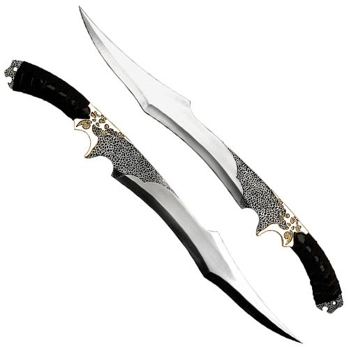

# Talon - Replica

## Desc

Quality shortsword taken from the Despereaux armories by Luzca Despereaux. Made to emulate the Talon short sword, a Despereaux family heirloom.

## Info

| Name | # | Class | Effect | Tier | Durability | LB | Value |
| :--: | :-: | :---: | :----: | :--: | :--------: | :-: | :---: |
| Talon - Replica | 1 | Quality One-handed Thrusting Sword, Quality One-handed Slashing Sword |  | Quality | 15/15 | 1.5 | ? |

## Effects

| Name | Effect | Duration | Tier Required |
| :--- | :----: | :------: | :-----------: |
