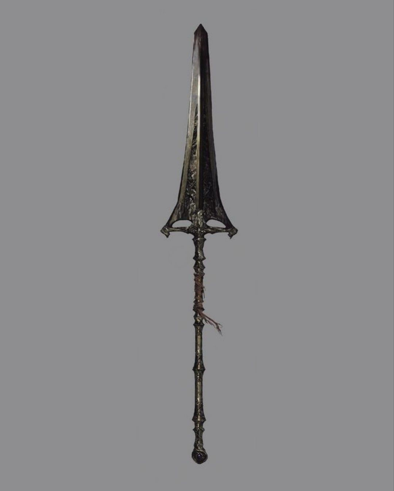

# The Spear of Destiny

## Desc

"Long ago, before the time of Fellkin or Brightkin, this weapon is said to have killed a piece of a god. The Bright Lord bestowed this weapon on his most loyal ally to do the same again." - Ancient texts

The Spear of Destiny, a massive artifact Swordspear,  is the most famous artifact on the continent. The Spear was first wielded by the Amon, Spear of the Brights, in service of The Bright Lord. Though in time, Amon would use the Spear in an attempt to overthrow The Bright Lord.

Eventually the Spear would end up in the possession of the Royal Family of the Dawn Empire, passed down to a sibling of the current Emperor. The siblings would wield the Spear as Amon did for their new emperor. For it is said that whoever wields the spear of Destiny influences the destiny of the world.

Whatever their heart truly desires will begin to manifest in the world. This is regardless of what the users think they want, it is what they truly desire.If the spear is claimed from combat or stolen by another, then the loser loses all their power. They will die in the coming days of mysterious causes.

The most famous of these was Booker Twins, the Golden Patriot. Seen as a symbol of strength and honor to the people of the Dawn Empire. Those that oppose the Dawn Empire had a much different perspective…

## Info

|         Name         | # |                                            Class                                            |                          Effect                          |   Tier   | Durability | LB | Value |
| :------------------: | :-: | :-----------------------------------------------------------------------------------------: | :------------------------------------------------------: | :------: | :--------: | :-: | :---: |
| The Spear of Destiny | 1 | Reach Hafted Blade, Reach Spear, Air Spellcasting Focus, Cold Spellcasting Focus, Electric Spellcasting Focus | Destiny Chosen, Destiny Strength/Reflex, Indestructible, | Artifact |   48/48   | 14 |   ?   |

## Effects

| Name                    |                                                                                                                                         Effect                                                                                                                                         | Duration | Tier Required |
| :---------------------- | :------------------------------------------------------------------------------------------------------------------------------------------------------------------------------------------------------------------------------------------------------------------------------------: | :------: | :-----------: |
| Destiny Strength/Reflex |                                                                                                                        Strength and reflex are set to level 4.                                                                                                                        |          |      12      |
| Destiny Chosen          |                                                                      Destiny Point Cap set to 6. Gain an additional Destiny Point whenever one is gained. Destiny begins to shape around the user's true desires.                                                                      |          |      12      |
| Binding of the Moon     | This weapon can only be picked up by those who sing (out loud or in their head) the Lullaby of the Moon. If the weapon is held for a fortnight, the weapon is bound to the users, severing the bond with the previous bearer. The bearer can now dismiss and summon the blade at will. |          |       8       |
| Indestructible          |                                                                                                                            This item can't lose durability.                                                                                                                            |          |      10      |
