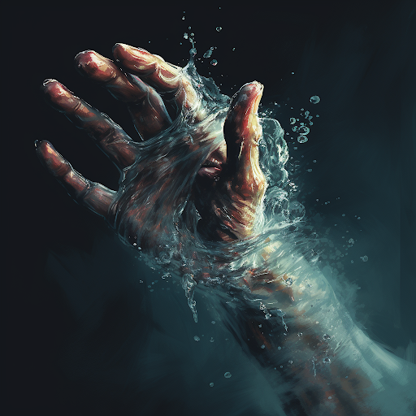

# Hydrocraft

Hydrocraft users can narratively attempt the following:

- Create water.
- Absorb water into the body.
- Manipulate water (could also affect tea, milk, coffee, etc).
- Resistance water pressure and cold water.
- Water breathing
- Deep Sense (Assist for Perception checks)

#### Specialization: The Kraken

The way of the Kraken involves using a form of jet propulsion, sucking water into squid-like growths on the body and propelling outward. One of the most popular forms of Hydromancy is to create a water tentacle from yourself. These can assist in movement, defense, or offense.

The most common form of Hydrocraft is derived from the Kraken. The way of the Kraken involves using a form of jet propulsion, sucking water into squid-like growths on the body and propelling outward.

#### Specialization: The Sea Serpent

Dragons channel their from the elemental scales that cover their bodies.

##### Dragontide

Allows the user to breath dragontide from from their mouth. Dragontide the user produces has an odd dark coloring to it. Dragontide has a mind of its own, leaping from thrashing and drowning anything around it. The raw destructive power is terrifying, as given the right circumstance things can quickly go out of hand.

#### Absorbing Fellblood: Water

Water can be used to absorb Fellblood. This can be done by submerging oneself in water or meditating near a large body of water.
