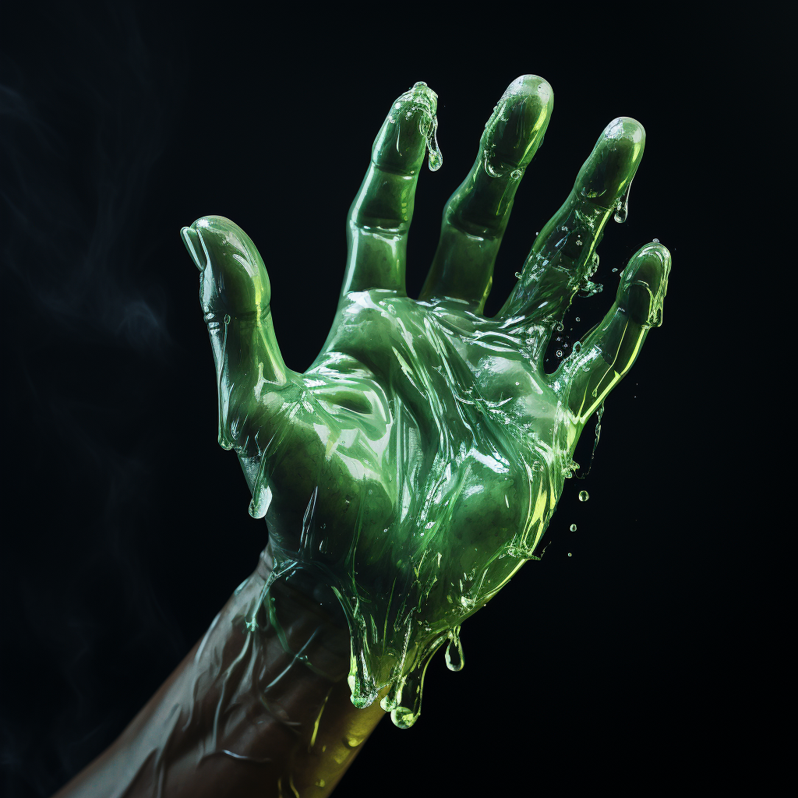

# Toxincraft

Toxincraft users can narratively attempt the following:

- Create toxins, venoms, poisons, acid, antivenom, etc...
- Manipulate toxins, venoms, poisons, acid, antivenom, etc...
- (Heartbeats) to assist Perception Checks

#### Specialization: Dragonvenom

Dragon Venom is legendary in its destructive capabilities. Dragons channel from the elemental scales that cover their bodies. Any affected by the powerful neurotoxin are instantly paralyzed.

Dragon venom never degrades or dries out. It is tasteless and odorless, making it a preferred tool of assassins. Common antivenom have zero effect on it. A person affected with the venom has visible black veins visible through their skin as the necrotic effects kill from within.

#### Absorb Fellblood: Toxins

Toxins can be used to absorb Fellblood. If the toxin is already within the user, they may absorb it.
