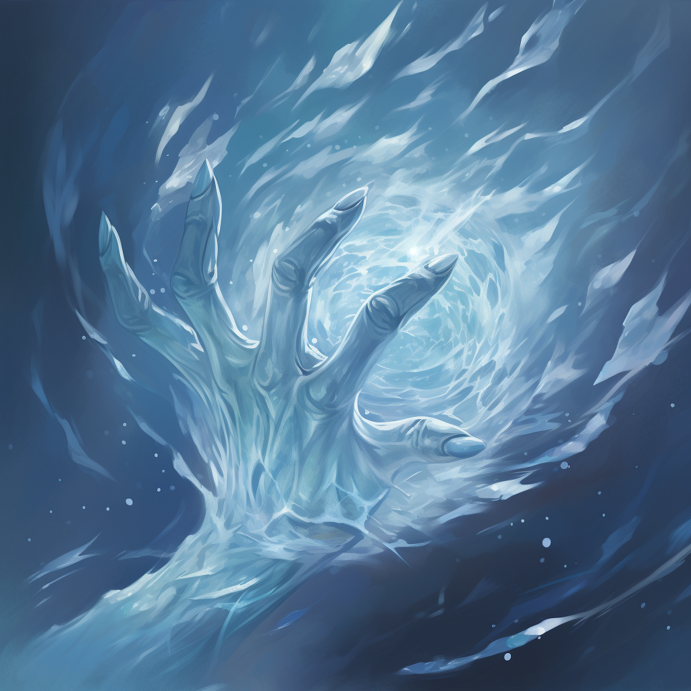

# Blizzardcraft

Blizzardcraft users can narratively attempt the following:

- Create blizzards.
- Manipulate blizzards.

#### Fellweave Combination: Blizzardcraft

This Fellweave can only be accessed by users with a specialization in Galecraft and Cryocraft. The lowest dice total of the required Fellweave will be used for this Fellweave.

#### Specialization: The Blizzard Dragon

In the frigid places of Terra, Blizzard Dragon will bury entire kingdoms in great blizzards to feast on the frozen corpses of the dead. The great blizzards around them act as camouflage to mask their movements.

##### Create Blizzards

Like the Blizzard Dragon, Blizzardcraft users may manipulate the Blizzards to their liking. How large and furious the blizzard determines the check required. A check to increase the ferocity of a blizzard already in progress should be far easier than if the user tried to do the same with a sunny warm day.
