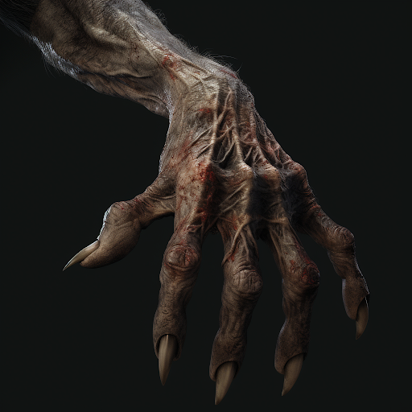

## Fellweave

The monsters of Terra are known for their terrifying speed, strength, and elemental abilities. Their bodies achieve these abilities by using the potential energy found in their blood, referred to as Fellblood.

Due to their monstrous ancestry, Fellkind carries Fellblood, the potential energy found monster blood in their veins as well. All of Fellweave derives it's power from Fellblood. Fellkin are able to express their dormant genes, mimicking the terrifying genetic abilities of their monstrous ancestors. These abilities can often entail rather grotesque restructuring of the user's physiology. Fellweave takes training, practice, and study to master, leading most Fellkin never follow the path of mastering Fellweave.

- Magic Name: Fellweave
- Magic Vocation Name: Fellweaver
- Magic Vocation Governing Attributes: STR, RFX, INT
- Magic Resource Name: Fellblood
- Cantrip Name: Trick
- Governing Core Skill: Endurance

### Silverburn

A reaction caused by silver coming into contact with Fellblood. Has various effects depending on the monster or Fellkin in question. Monsters/Fellkin will both suffer an extreme allergic reaction, often combusting the Fellblood in their blood.

If a character has at least a level 1 in the "Fellkin" or equivalent vocation, they gain a Minor weakness to silver damage.

Silverburn damage taken while transformed by Fellblood, forces the user to make an Endurance check to maintain their form.

* CL of  Endurance check will be level of injury dealt + 1.
* If the user fails, then they lose all active Fellweave buffs.
* For monsters this often means reducing their base attributes like STR and RFX.

### Fellweave Tree

The only way for Fellkin to obtain new Fellweave is to emulate the genetic links of the Monsters they originate from.

This tree represents the different path to acquire different Fellweaves. Each solid line represents a monster whose genes bridge between Fellweaves. For instance, Vampires represent the links between Hemacraft and Mindcraft as well as Mindcraft and Shadowcraft. While Vampires represent this on the Fellweave Tree, these genes may exist in other monsters. This tree just shows the natural progression a Fellkin could take to acquire new Fellweave.

Squares representing non-combination Fellweaves. These can be accessed if you choose this if your race has access or if you have a neighboring Fellweave square already at level 0 in that Fellweave skill. Any newly gained Fellweave starts at level -1.

Circles represent Fellweave combinations, which require the Fellweaves that attach to it in order to use. The level of the combo Fellweave is equal to the lowest dice roll of the Fellweaves required.

### Fellweave List

- [Polycraft](Polycraft/Polycraft.md)

- [Blazecraft](Blazecraft/Blazecraft.md)

- [Hydrocraft](Hydrocraft/Hydrocraft.md)

- [Electrocraft](Electrocraft/Electrocraft.md)

- [Terracraft](Terracraft/Terracraft.md)

- [Galecraft](Galecraft/Galecraft.md)

- [Cryocraft](Cryocraft/Cryocraft.md)

- [Naturecraft](Naturecraft/Naturecraft.md)

- [Toxincraft](Toxincraft/Toxincraft.md)

- [Soulcraft](Soulcraft/Soulcraft.md)

- [Shadowcraft](Shadowcraft/Shadowcraft.md)

- [Mindcraft](Mindcraft/Mindcraft.md)

- [Ferracraft](Ferracraft/Ferracraft.md)

- [Sonocraft](Sonocraft/Sonocraft.md)

- [Hemacraft](Hemacraft/Hemacraft.md)

- [Spidercraft](Spidercraft/Spidercraft.md)

- [Plasmacraft](Plasmacraft/Plasmacraft.md)

- [Stormcraft](Stormcraft/Stormcraft.md)

- [Magmacraft](Magmacraft/Magmacraft.md)

- [Blizzardcraft](Blizzardcraft/Blizzardcraft.md)
