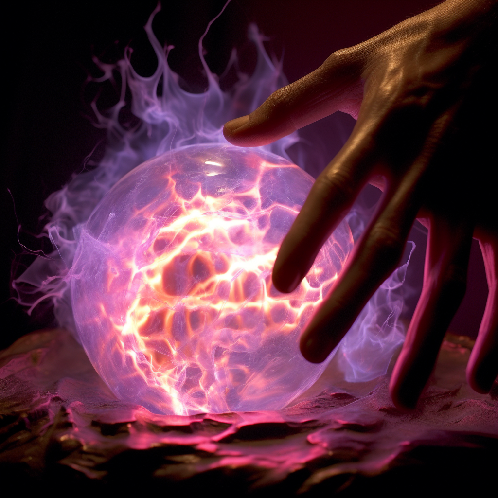

# Plasmacraft

Plasmacraft users can narratively attempt the following:

- Create and manipulate plasma.
- Cut through objects using plasma.
- Create solar flare-like attacks.
- Emulate properties of solar energy.

Plasmacraft is the domain of true masters of Fellweave. Plasmacraft is said to emulate the properties of the Sun, though it exhibits none of the Holy properties of Radiance Miracles.

#### Fellweave Combination: Plasmacraft

This Fellweave can only be accessed by users with a specialization in Blazecraft and Galecraft. The lowest dice total of the required Fellweave will be used for this Fellweave.

#### Specialization: The Ancient Dragon

Ancient myths tell how when the first dragons were born, they were granted wings. They flew to the Sun and drank it. They breathed light so hot it would cut stone and turn night to day.

#### Absorbing Fellblood: Solar and Plasma

Plasma and Sunlight can be used to absorb Fellblood.
