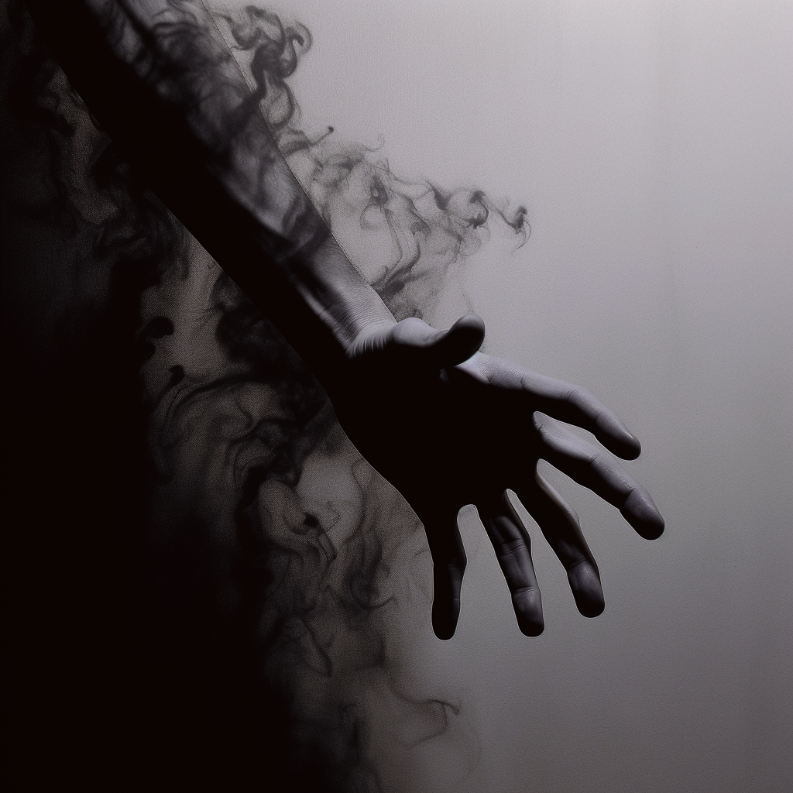

# Shadowcraft

Shadowcraft users can narratively attempt the following:

- Create and manipulate shadow
- Shadowleap
- Improve your stealth

#### Shadow Leaping

Shadow Leaping is a form of short range teleportation. The user must have access to a large shadow near them that is not their own shadow. They can use it as a door to a neighboring shadow, rematerialized there.

#### Specialization: The Shadow Dragon

Dragonumbra is legendary in its destructive capabilities. Dragons channel their from the elemental scales that cover their bodies.

##### Dragonumbra

Allows the user to breath dragonumbra from their mouth. Dragonumbra encroaches on all light sources around it, fading them out. Darksight does not work in dragonumbra. Entities will attack and abduct anyone in the darkness. This dragonumbra has a mind of its own. The raw destructive power is terrifying, as given the right circumstance things can quickly go out of hand.

#### Absorb Fellblood: Shadow

Shadow can be used to absorb Fellblood. This can be done in pitch black environments.

#### Dark Resistance

By achieving a CL 3 check, for the cost of 1 Fellblood a character may gain resistance to this element equal to the points invested in this Fellweave. This effect has a duration of 1 hour.
